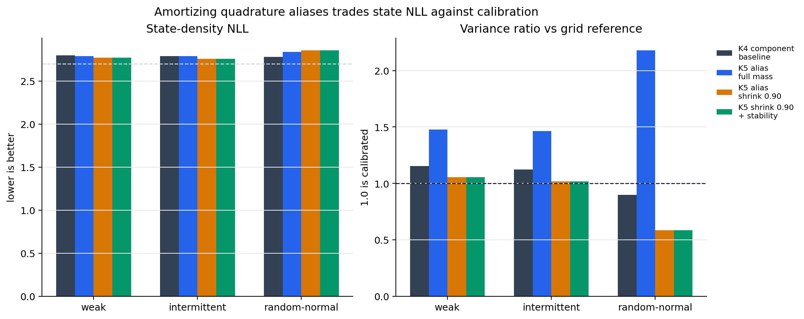
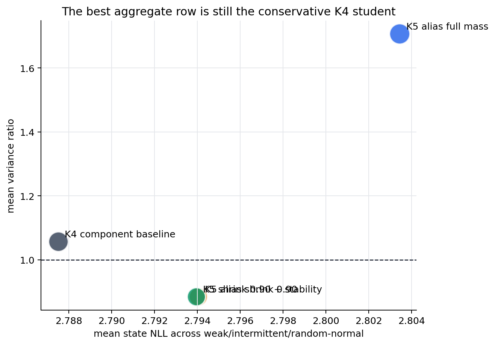

The previous post in this sequence, [Reference-Free Quadrature Filters For The Sine Benchmark](/posts/quadrature-power-ep-filtering/), found a useful but awkward result. Deterministic quadrature ADF and Power-EP updates were strong nonlinear filters even without grid-reference targets. In particular, prior-weighted alias-indexed Power-EP could recover state density in the random-normal stressor where simpler K4 spread filters failed.

The awkward part was calibration. The best alias-heavy deterministic filter often carried too much mass across aliases. That helped state NLL in some regimes and hurt predictive calibration in others.

This session asked the next question:

> Can a strict learned mixture filter amortize the deterministic quadrature / alias Power-EP update, including its predictive normalizer, without inheriting bad alias-mass calibration?

The answer from this pass is: partially. The new teacher-student objective works and gives targeted weak/intermittent improvements, but the aggregate row still loses to the conservative K4 component baseline. That negative result is useful because it points at the actual bottleneck: not another generic neural head, but how alias mass is represented and calibrated.



## The Filtering Setup

The nonlinear benchmark is still a scalar state-space model:

\[
z_t = z_{t-1} + w_t,\quad w_t \sim \mathcal{N}(0,Q)
\]

\[
y_t = x_t \sin(z_t) + v_t,\quad v_t \sim \mathcal{N}(0,R)
\]

A Kalman filter works because the posterior stays Gaussian under linear-Gaussian dynamics. Here the sine likelihood breaks that closure. If \(x_t \sin(z_t)\) is observed, then states separated by about \(2\pi\) can explain similar observations. The posterior can become multi-modal.

The strict learned filter is allowed to carry a Gaussian mixture:

\[
q^F_t(z_t) = \sum_{k=1}^K \pi_{t,k}\,
\mathcal{N}(z_t; \mu_{t,k}, \sigma^2_{t,k})
\]

but it must remain an online filter:

\[
q^F_t = \operatorname{update}_\theta(q^F_{t-1}, x_t, y_t)
\]

There is no hidden recurrent state in the headline rows. The belief itself has to carry the uncertainty.

## ADF, Power-EP, And The Local Tilt

Assumed-density filtering is the old idea hiding underneath the experiment. Start with a carried filtering belief \(q^F_{t-1}\), push it through the transition, multiply by the new likelihood, then project back into a tractable family.

The transition-predictive belief is:

\[
q^-_t(z_t)
= \int p(z_t \mid z_{t-1}) q^F_{t-1}(z_{t-1})\,dz_{t-1}
\]

The exact local Bayesian update would be:

\[
p(z_t \mid y_{\le t})
\propto p(y_t \mid z_t, x_t) q^-_t(z_t)
\]

ADF replaces that exact posterior with a projection:

\[
q^F_t
= \Pi_{\mathcal{Q}}\left[
p(y_t \mid z_t, x_t)q^-_t(z_t)
\right]
\]

Power-EP changes the local geometry by raising the likelihood to a power:

\[
\tilde p_\alpha(z_t)
\propto p(y_t \mid z_t, x_t)^\alpha q^-_t(z_t)
\]

In this codebase, the deterministic teacher computes that local tilted distribution with Gauss-Hermite quadrature and projects it back to a Gaussian mixture. That teacher is reference-free in the important sense: it uses the known model and observations, not latent states or grid posterior moments.

## Why The Predictive Normalizer Matters

The pre-update predictive likelihood is:

\[
Z_t
= p(y_t \mid y_{<t}, x_t)
= \int p(y_t \mid z_t, x_t) q^-_t(z_t)\,dz_t
\]

For a mixture belief, the implementation computes this as a mixture of quadrature estimates:

\[
\log Z_t
= \log \sum_k \pi^-_{t,k}
\int p(y_t \mid z_t,x_t)
\mathcal{N}(z_t;\mu^-_{t,k},\sigma^{2,-}_{t,k})\,dz_t
\]

This quantity matters because it scores the belief before the observation is used to update it. A filter can look good after assimilation while still carrying the wrong pre-update mass. The notes for this branch specifically recommended targeting this predictive normalizer directly, rather than adding another scalar predictive-y auxiliary.

## What Changed In This Session

The quadrature distillation trainer now supports three pieces:

| Piece | Purpose |
|---|---|
| alias Power-EP teacher options | expose mode-preserving alias projection, prior-alias weighting, shrink, entropy, and top-k knobs |
| predictive-normalizer target | match the teacher \(\log Z_t\) with a squared error term |
| short rollout distillation | initialize short windows from teacher beliefs, then train the student through self-fed rollouts |

The main config was:

```text
experiments/nonlinear/14_quadrature_alias_power_ep_rollout_normalizer_k5.yaml
```

It used:

| Setting | Value |
|---|---:|
| components | K5 |
| teacher | prior-weighted alias-indexed Power-EP |
| likelihood power | 0.5 |
| alias spacing | \(2\pi\) |
| rollout horizon | 4 |
| predictive-normalizer weight | 1.0 |
| seed | 321 |

The follow-up experiments then tested whether the bad calibration came from too much alias mass:

- full K5 alias rollout-normalizer;
- K5 with alias mean shrink `0.85`, `0.90`, `0.95`;
- K5 with a generic component-stability regularizer;
- K5 shrink `0.90` plus stability.

The stability regularizer was deliberately not sine-specific. It penalizes component churn by keeping component \(k\) near its own transition-predicted component \(k\), and by discouraging abrupt weight changes:

\[
\mathcal{L}_{\text{stable}}
=
\sum_{t,k} \bar \pi_{t,k}
\frac{(\mu_{t,k} - \mu^-_{t,k})^2}{\sigma^{2,-}_{t,k}}
+ \lambda_v
\sum_{t,k} \bar \pi_{t,k}
\left(\log \sigma^2_{t,k} - \log \sigma^{2,-}_{t,k}\right)^2
+ \lambda_\pi
\sum_{t,k}
\pi^-_{t,k}\log\frac{\pi^-_{t,k}}{\pi_{t,k}}
\]

That tests a more general idea than "sine aliases are \(2\pi\)-spaced": mixture components should have persistent identities during filtering.

## Results

The aggregate comparison used weak, intermittent, and random-normal stressors. Those are the important cases because they expose low-observation information, missing observations, and irregular observation amplitudes.



| variant | mean state NLL | mean pred-y NLL | mean cov90 | min cov90 | mean var ratio |
|---|---:|---:|---:|---:|---:|
| K4 component baseline | 2.787505 | 0.522798 | 0.906386 | 0.886149 | 1.057096 |
| K5 shrink 0.90 + stability 0.03 | 2.793952 | 0.515567 | 0.864692 | 0.765137 | 0.884604 |
| K5 shrink 0.90 | 2.794042 | 0.515595 | 0.864610 | 0.764893 | 0.884503 |
| K5 full alias mass | 2.803440 | 0.524354 | 0.960802 | 0.951091 | 1.707011 |
| K5 stability 0.10 | 2.798732 | 0.523812 | 0.961860 | 0.951172 | 1.729154 |

The K4 component baseline is still the best aggregate row. It is boring in the right way: decent state NLL, coverage near the target, and variance ratio near one.

The K5 shrink row is more interesting but less robust. It improves state NLL on weak and intermittent:

| pattern | K4 state NLL | K5 shrink 0.90 state NLL | K4 var ratio | K5 shrink 0.90 var ratio |
|---|---:|---:|---:|---:|
| weak | 2.795133 | 2.768477 | 1.153190 | 1.054112 |
| intermittent | 2.786885 | 2.758564 | 1.121537 | 1.016610 |
| random-normal | 2.780498 | 2.855084 | 0.896560 | 0.582786 |

That last row is the problem. Shrinking alias means fixes overdispersion in weak and intermittent cases, but makes random-normal underdispersed. The student is no longer carrying enough uncertainty when the observation amplitude is irregular.

The generic component-stability regularizer did not materially change that tradeoff. With shrink `0.90`, stability moved metrics only in the fourth decimal place. Without shrink, stability left the K5 row overdispersed.

## Interpretation

The experiment rejects a simple story.

It is not enough to say "use the alias teacher." Full K5 alias distillation carries too much mass:

```text
mean variance ratio: 1.707
min coverage:        0.951
```

It is also not enough to say "shrink the aliases." K5 shrink `0.90` gets the weak/intermittent rows right, but random-normal collapses too much mass:

```text
random-normal variance ratio: 0.583
random-normal coverage:       0.765
```

And it is not enough to add a generic persistence penalty. Component stability is a reasonable regularizer, but the observed failure is not mostly component churn. It is a teacher/student calibration mismatch: the teacher's alias mass is useful in one regime and too broad or too narrow in another.

That is a good research result. It says the next useful work is diagnostic:

- effective number of mixture components over time;
- weight entropy and alias-mass concentration;
- teacher-student \(\log Z_t\) error by pattern and time;
- variance ratio by time, not just globally;
- whether predictive-normalizer matching conflicts with state-density distillation.

Those diagnostics should be run before another objective sweep. The scalar weights are no longer the most informative knob.

## Reproducibility Notes

The runs in this post used seed `321` and the ignored local output directories:

```text
outputs/nonlinear_quadrature_alias_power_ep_rollout_normalizer_k5_suite_2026_04_30
outputs/nonlinear_alias_shrink_followup_2026_04_30
outputs/nonlinear_component_stability_followup_2026_04_30
```

The most relevant source files are:

- `scripts/train_quadrature_adf_distilled.py`
- `scripts/sweep_quadrature_adf_distilled.py`
- `experiments/nonlinear/14_quadrature_alias_power_ep_rollout_normalizer_k5.yaml`

The copied review artifacts for this post are:

- [selected metrics](artifacts/selected-metrics.csv)
- [K5 rollout-normalizer summary](artifacts/k5-rollout-normalizer-summary.md)
- [alias shrink summary](artifacts/alias-shrink-summary.md)
- [component stability summary](artifacts/component-stability-summary.md)

The short version is:

> Amortizing deterministic quadrature updates is viable, but alias mass is the calibration bottleneck. K4 remains the safer aggregate learned filter; K5 alias distillation is the right diagnostic branch, not yet the promotion row.
