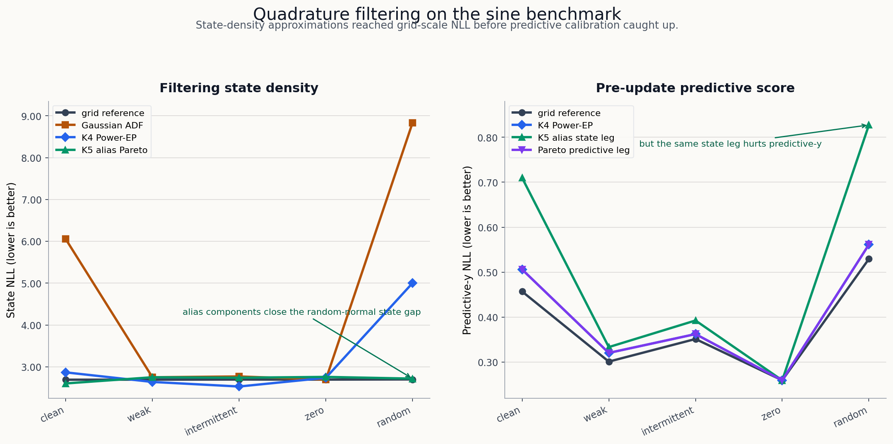

This is a long technical note about a small research program in Bayesian filtering.
The starting point is familiar if you know Kalman filters: there is a hidden state,
there are noisy measurements, and the filter has to update its belief online.

The work here asks a narrower question:

> Can we learn or design strict online filters that keep an explicit posterior belief,
> remain auditable, and survive nonlinear observations?

The short answer is that the linear-Gaussian case is now a reliable debugging
suite, but the nonlinear case exposed several different failure modes. Plain
local ELBO training tends to become under-dispersed. Reference distillation shows
that good strict filters exist, but it is not a fair unsupervised result. Mixture
IWAE objectives help state density a lot, but can hurt one-step observation
prediction. Deterministic quadrature ADF and Power-EP baselines then show that
much of the gap is algorithmic: if we use the known likelihood directly, a
reference-free filter can get close to the grid reference in several regimes.

The intended reader knows the Kalman filter, but may not know variational
filtering, assumed-density filtering, IWAE, FIVO, or Power-EP. I will define the
pieces as we go.

The source code lives in [`dwrtz/ml-examples`](https://github.com/dwrtz/ml-examples).
The main implementation files are:

- [`src/vbf/models/cells.py`](https://github.com/dwrtz/ml-examples/blob/428810be819a87b2bf625b2a2f8b54f541105bb5/src/vbf/models/cells.py)
- [`src/vbf/nonlinear.py`](https://github.com/dwrtz/ml-examples/blob/428810be819a87b2bf625b2a2f8b54f541105bb5/src/vbf/nonlinear.py)
- [`scripts/train_nonlinear.py`](https://github.com/dwrtz/ml-examples/blob/428810be819a87b2bf625b2a2f8b54f541105bb5/scripts/train_nonlinear.py)
- [`scripts/sweep_nonlinear_learned.py`](https://github.com/dwrtz/ml-examples/blob/428810be819a87b2bf625b2a2f8b54f541105bb5/scripts/sweep_nonlinear_learned.py)

Related shorter posts:

- [Variational Filtering, Rebuilt From the Linear Case](/posts/vbf-linear-gaussian-calibration/)
- [Repairing a Nonlinear Strict Filter Without Reference Targets](/posts/nonlinear-strict-filter-objective-repair/)
- [When Mixtures Beat Local ELBO In Nonlinear Filtering](/posts/mixture-iwae-filtering-branch/)
- [Reference-Free Quadrature Filters For The Sine Benchmark](/posts/quadrature-power-ep-filtering/)

## The filtering problem

A state-space model has hidden states \(z_t\), observations \(y_t\), optional
observed covariates \(x_t\), a transition model, and an observation model:

\[
p(z_{0:T}, y_{1:T} \mid x_{1:T})
= p(z_0)\prod_{t=1}^T p(z_t \mid z_{t-1})p(y_t \mid z_t, x_t).
\]

The online filtering posterior is:

\[
p(z_t \mid y_{1:t}, x_{1:t}).
\]

For a linear-Gaussian model, the Kalman filter gives this posterior exactly.
For nonlinear observations, exact filtering is usually unavailable, so we choose
an approximate belief family and an update rule.

The strict filter contract in these experiments is:

\[
q^F_t = \operatorname{update}(q^F_{t-1}, x_t, y_t).
\]

The update is online. It does not get future observations. The filter must carry
an explicit posterior belief \(q^F_t(z_t)\), not just a hidden RNN state.

The variational Bayesian filtering form used in the repo carries one more piece:
a backward conditional over the previous state. The local edge posterior is
factorized as:

\[
q^E_t(z_t, z_{t-1})
= q^F_t(z_t)q^B_t(z_{t-1}\mid z_t).
\]

This edge view matters because the transition model couples \(z_{t-1}\) and
\(z_t\). If the filter emits both a current marginal and a backward conditional,
we can score the local edge against the generative model.

## The two benchmark worlds

The first world is scalar linear-Gaussian:

\[
z_t = z_{t-1} + w_t,\quad w_t \sim \mathcal{N}(0,Q),
\]

\[
y_t = x_t z_t + v_t,\quad v_t \sim \mathcal{N}(0,R).
\]

Here we know the exact answer. This is where we check the mechanics: Kalman
oracles, edge posteriors, ELBO terms, coverage, predictive likelihoods, and
calibration.

The second world keeps the random-walk state but changes the observation:

\[
y_t = x_t \sin(z_t) + v_t,\quad v_t \sim \mathcal{N}(0,R).
\]

This model is scalar, but it is not easy. The sine observation is periodic, so
different latent states can explain the same observation. When \(x_t\) is small,
the measurement carries little information about \(z_t\). The stress patterns
used in the reports are:

| Pattern | What it tests |
|---|---|
| sinusoidal | ordinary nonlinear observation strength |
| weak sinusoidal | observations are systematically weak |
| intermittent sinusoidal | informative and uninformative spans alternate |
| zero | no state information in the observations |
| random normal | irregular observation scale and aliasing |

For nonlinear diagnostics, the repo uses a deterministic one-dimensional grid
filter as a reference. That reference is expensive enough to cache, but it is
not used in fully unsupervised training rows.

## The evaluation metrics

Most tables use four quantities.

State NLL is the negative log likelihood of the true latent state under the
filtering belief:

\[
\operatorname{NLL}_z
= -\frac{1}{BT}\sum_{b,t}\log q^F_{b,t}(z_{b,t}^{\mathrm{true}}).
\]

Coverage 90 is the fraction of true states inside the nominal 90 percent
interval of the reported belief. For a calibrated Gaussian filter, this should
be near \(0.90\).

Variance ratio compares the learned filtering variance to the reference
filtering variance:

\[
\operatorname{var\ ratio}
= \frac{\mathbb{E}_{b,t}[\operatorname{Var}_{q}(z_{b,t})]}
{\mathbb{E}_{b,t}[\operatorname{Var}_{\mathrm{ref}}(z_{b,t})]}.
\]

A variance ratio far below one is under-dispersion. It means the filter is too
confident. In these experiments, under-dispersion is the recurring failure mode.

Predictive-y NLL scores the next measurement before assimilation:

\[
-\log p_q(y_t \mid y_{<t}, x_{\leq t}).
\]

This is important because a filter can put density on the true latent state
while still being a poor observation predictor. That tradeoff appears in the
mixture and quadrature branches.

## Why labels matter

The reports use several training-signal labels. They are not bookkeeping trivia;
they decide which claims are fair.

| Label | What training can use | What it means |
|---|---|---|
| fully unsupervised | \(x,y\), known transition, known observation model, prior | fair reference-free learning result |
| reference-free deterministic | same model information, but no learned amortized objective | fair algorithmic filtering baseline |
| reference-distilled diagnostic | grid moments or reference beliefs | positive control, not fair unsupervised |
| oracle-calibrated diagnostic | oracle/reference variance targets | identifies bottlenecks, not a deployable objective |
| supervised | true latent states or oracle edge targets | useful engineering control |

The strongest-looking row is not always the strongest claim. A reference-distilled
row can show that a posterior family is capable, while a fully unsupervised row
shows that the objective found it without hidden help.

## Technique 1: exact Kalman filtering

The Kalman filter is the anchor. In the scalar linear-Gaussian model, if the
prior belief is \(z_{t-1}\sim \mathcal{N}(m_{t-1},P_{t-1})\), then the predictive
state is:

\[
m^-_t = m_{t-1},\quad P^-_t = P_{t-1} + Q.
\]

For observation \(y_t = x_t z_t + v_t\), the innovation and Kalman gain are:

\[
e_t = y_t - x_t m^-_t,
\]

\[
S_t = x_t^2P^-_t + R,
\]

\[
K_t = \frac{P^-_t x_t}{S_t}.
\]

The filtering update is:

\[
m_t = m^-_t + K_t e_t,\quad
P_t = P^-_t - K_t x_t P^-_t.
\]

The repo keeps this exact path because it gives a hard standard for state NLL,
coverage, variance, and predictive likelihood. In the scalar benchmark, exact
Kalman coverage stays close to \(0.90\), and the frozen-marginal control matches
it almost exactly.


That figure is from the linear-Gaussian ELBO run. The important role of the
linear suite is not that it is hard. The role is that mistakes have nowhere to
hide.

The compact linear report found:

| Regime | Exact/reference behavior | Learned behavior |
|---|---|---|
| nominal sinusoidal | Kalman state NLL `0.402`, coverage `0.900` | self-fed supervised state NLL `0.415` |
| weak sinusoidal | Kalman state NLL `1.175`, coverage `0.899` | MC ELBO state NLL `1.291`, coverage `0.813` |
| zero unobservable | Kalman state NLL `2.740`, coverage `0.904` | MC ELBO state NLL `7.010`, coverage `0.392` |
| random normal | Kalman state NLL `0.219`, coverage `0.898` | MC ELBO state NLL `0.307`, coverage `0.847` |

That zero-observation row is the warning sign. If observations contain no
information, a calibrated filter should mostly propagate uncertainty. The local
MC ELBO row became much too narrow.

## Technique 2: frozen-marginal edge learning

The VBF model represents a local edge:

\[
q^E_t(z_t,z_{t-1}) = q^F_t(z_t)q^B_t(z_{t-1}\mid z_t).
\]

In the frozen-marginal control, \(q^F_t\) is not learned. It is set to the exact
Kalman marginal. The learned part is only the backward conditional
\(q^B_t(z_{t-1}\mid z_t)\).

Why is that useful? It isolates whether the edge/backward machinery is correct.
If the filtering marginal is exact and the backward head is trained, then any
bad filtering metric would indicate plumbing trouble rather than objective
trouble.

The frozen marginal row matched exact Kalman in the scalar reports. That gave
confidence that the edge representation itself was sane.

## Technique 3: residualized learned update cells

The first learned filters were not arbitrary neural networks. The structured
MLP cell starts from an analytic Kalman-like update and learns corrections.

In the linear case, a simplified version of the update is:

```python
pred_var = prev_var + q
innovation = y_t - x_t * prev_mean
innovation_var = x_t**2 * pred_var + r
base_gain = pred_var * x_t / innovation_var
gain_scale = 2.0 * sigmoid(raw[..., 0])
filter_mean = prev_mean + gain_scale * base_gain * innovation
filter_var = base_filter_var * exp(clipped_raw_scale) + min_var
```

That pattern is implemented in
[`structured_mlp_step`](https://github.com/dwrtz/ml-examples/blob/428810be819a87b2bf625b2a2f8b54f541105bb5/src/vbf/models/cells.py#L451).
The nonlinear structured cell uses an EKF-like local linearization:

\[
h(z,x) = x\sin(z),\quad
\frac{\partial h}{\partial z} = x\cos(z).
\]

The base update is then corrected by learned residual terms.

This design is conservative. It says: keep useful filtering structure when it is
available, then learn the parts the analytic approximation gets wrong.

## Technique 4: supervised and self-fed edge distillation

Supervised distillation uses an oracle edge posterior or reference filtering
beliefs as targets. The most direct loss is a Gaussian KL:

\[
\operatorname{KL}\left(q_{\mathrm{oracle}}(z_t,z_{t-1})
\Vert q_{\theta}(z_t,z_{t-1})\right).
\]

Teacher forcing feeds the model the reference previous belief. Self-fed rollout
feeds the model its own previous belief.

The distinction matters. Teacher forcing can show one-step capacity. Self-fed
training tests whether errors compound when the filter is actually used.

In the nonlinear reports, teacher-forced structured moment distillation showed
that the structured head could learn the one-step reference map:

| Case | Mode | state NLL | coverage 90 | variance ratio |
|---|---|---:|---:|---:|
| weak | teacher-forced structured | 2.790 | 0.888 | 1.112 |
| intermittent | teacher-forced structured | 2.761 | 0.901 | 1.034 |

But self-fed structured rollout was unstable until horizon rollout distillation
was introduced.

## Technique 5: local edge ELBO

The unsupervised local edge ELBO scores the edge factor against the generative
model:

\[
\begin{aligned}
\mathcal{L}_t
&= \mathbb{E}_{q^F_t(z_t)q^B_t(z_{t-1}\mid z_t)}
\big[
\log p(y_t\mid z_t,x_t)
+ \log p(z_t\mid z_{t-1}) \\
&\quad + \log q^F_{t-1}(z_{t-1})
- \log q^F_t(z_t)
- \log q^B_t(z_{t-1}\mid z_t)
\big].
\end{aligned}
\]

The JAX code samples \(z_t\), samples \(z_{t-1}\) from the backward conditional,
and computes the log weight:

```python
return (
    normal_log_prob(y, observation_mean, r)
    + normal_log_prob(z_t, z_tm1, q)
    + normal_log_prob(z_tm1, prev_mean, prev_var)
    - normal_log_prob(z_t, filter_mean, filter_var)
    - normal_log_prob(z_tm1, backward_mean, backward_var)
)
```

In the scalar linear-Gaussian case, this is a reasonable unsupervised baseline,
but it is under-dispersed in weak and zero-observation regimes. In the nonlinear
case, it is much worse: local explanations can be plausible at a single step but
globally inconsistent over a trajectory.

That gives the core diagnosis:

\[
\text{local plausible explanation}
\rightarrow \text{too-narrow posterior}
\rightarrow \text{bad next prior}
\rightarrow \text{compounding error}.
\]

## Technique 6: oracle variance calibration

Oracle variance calibration adds penalties that compare learned filtering
variance to reference variance. For example:

\[
\left(\log
\frac{\mathbb{E}[\operatorname{Var}_q(z_t)]}
{\mathbb{E}[\operatorname{Var}_{\mathrm{ref}}(z_t)]}
\right)^2.
\]

There are variants:

- global variance ratio;
- time-local variance ratio;
- low-observation weighted variance ratio;
- regime-local variance ratio for randomized \(Q/R\).

These rows are not fully unsupervised because they use reference variance
targets. They are still useful because they identify what went wrong.

In the zero-observation nonlinear case, reference calibration recovers the grid
reference uncertainty:

| Case | Model | state NLL | coverage 90 | variance ratio |
|---|---|---:|---:|---:|
| zero | baseline | 15.471 | 0.264 | 0.050 |
| zero | time w1 | 2.732 | 0.910 | 1.004 |

That says the evaluation and reference machinery are coherent. It also says the
unassisted objective was failing to preserve uncertainty.

## Technique 7: grid reference filtering

For the nonlinear scalar benchmark, the reference filter discretizes a grid over
\(z\). At each step it propagates mass through the Gaussian transition, multiplies
by the nonlinear likelihood, and renormalizes:

\[
\tilde{p}_t(z_t)
= \int p(z_t\mid z_{t-1})p_{t-1}(z_{t-1})\,dz_{t-1},
\]

\[
p_t(z_t)
\propto p(y_t\mid z_t,x_t)\tilde{p}_t(z_t).
\]

In code, that is a log-space matrix update over the grid:

```python
pred_log_mass = logsumexp(
    prev_log_mass[:, :, None] + transition_log_mass[None, :, :],
    axis=1,
)
filter_log_mass = pred_log_mass + normal_log_prob(y_t[:, None], obs_mean, r)
filter_log_mass = filter_log_mass - logsumexp(filter_log_mass, axis=1, keepdims=True)
```

The grid filter is used for diagnostics and reference-distilled controls. It is
not used to train fully unsupervised rows.

## Technique 8: reference moment distillation

Reference moment distillation trains a neural filter to match grid-reference
moments:

\[
\frac{(m_\theta - m_{\mathrm{ref}})^2}
{P_{\mathrm{ref}}}
+
\left(\log P_\theta - \log P_{\mathrm{ref}}\right)^2.
\]

This is not a fair unsupervised method, but it answers a critical question:
does the strict family have enough capacity?

The answer was yes. A direct moment-distilled head reached:

| Case | state NLL | coverage 90 | variance ratio |
|---|---:|---:|---:|
| weak | 2.806 | 0.832 | 0.665 |
| intermittent | 2.806 | 0.832 | 0.656 |

That was far better than vanilla nonlinear ELBO. It showed that a strict
Gaussian filter can perform well if the training signal is strong enough.

## Technique 9: horizon rollout distillation

Structured teacher-forced distillation had one-step capacity but poor self-fed
rollout. Horizon rollout distillation addresses that by starting from reference
beliefs, rolling the learned update for \(H\) steps, and penalizing reference
moment error throughout the rollout.

For horizon \(H=4\), the structured head became much more stable:

| Case | state NLL | coverage 90 | variance ratio |
|---|---:|---:|---:|
| weak | 2.808 | 0.881 | 0.993 |
| intermittent | 3.340 | 0.861 | 1.124 |

The interpretation is subtle. The structured head can be calibrated, but it
needs a training signal that sees short self-fed futures. A one-step objective
is not enough.

## Technique 10: windowed joint ELBO

The first fully unsupervised nonlinear repair tried to make the ELBO
trajectory-consistent. Instead of scoring each edge independently, it samples a
short latent path from the terminal filtering marginal and backward conditionals.

For a window ending at \(s+H\):

\[
q(z_{s-1:s+H})
= q^F_{s+H}(z_{s+H})
\prod_{t=s}^{s+H}q^B_t(z_{t-1}\mid z_t).
\]

The objective scores the sampled path under the carried prior and the generative
model:

\[
\begin{aligned}
\mathcal{L}_{s,H}
&= \mathbb{E}_{q}
\big[
\log q^F_{s-1}(z_{s-1})
+ \sum_{t=s}^{s+H}\log p(z_t\mid z_{t-1}) \\
&\quad + \sum_{t=s}^{s+H}\log p(y_t\mid z_t,x_t)
- \log q^F_{s+H}(z_{s+H})
- \sum_{t=s}^{s+H}\log q^B_t(z_{t-1}\mid z_t)
\big].
\end{aligned}
\]

The implementation includes the sanity check that horizon one matches the local
edge ELBO. That is covered by `tests/test_train_nonlinear_objectives.py`.


The promoted Gaussian unsupervised repair combined:

```text
structured_joint_elbo_h4_w005_predictive_y_masked_y_spans_h4
```

It improved degraded-observation robustness:

| Condition | vanilla structured NLL | promoted NLL | vanilla var ratio | promoted var ratio |
|---|---:|---:|---:|---:|
| sinusoidal | 52.989 | 54.930 | 0.041 | 0.083 |
| weak | 20.865 | 14.672 | 0.058 | 0.090 |
| intermittent | 37.853 | 22.992 | 0.038 | 0.060 |
| zero | 13.474 | 8.414 | 0.056 | 0.107 |
| random normal | 113.958 | 60.109 | 0.014 | 0.040 |

This is a real improvement, but not a solved filter. The variance ratios remain
very low.

## Technique 11: causal predictive-y scoring

A filter should be useful before it assimilates the current measurement. The
pre-assimilation predictive term asks whether the previous filtering belief,
propagated through the transition, assigns probability to \(y_t\):

\[
p_q(y_t\mid y_{<t},x_t)
= \int p(y_t\mid z_t,x_t)
\left[\int p(z_t\mid z_{t-1})q^F_{t-1}(z_{t-1})dz_{t-1}\right]dz_t.
\]

For the sine observation this is computed with Gauss-Hermite quadrature:

```python
nodes, weights = hermgauss(num_points)
z = prev_mean[..., None] + sqrt(2.0 * pred_state_var[..., None]) * nodes
obs_mean = x[..., None] * sin(z)
log_likelihood = normal_log_prob(y[..., None], obs_mean, r)
log_prob_y = logsumexp(log_weights + log_likelihood, axis=-1) - 0.5 * log(pi)
```

This term is causal only if the update path has not already used \(y_t\) to
construct the prediction. The reports treat that as a guardrail.

## Technique 12: masked-y span training

Masked-y training withholds measurements from the update path for random points
or spans. When \(y_t\) is masked, the filter should perform the exact transition
prediction:

\[
m_t = m_{t-1},\quad P_t = P_{t-1} + Q.
\]

That behavior is tested in the nonlinear reference tests. The purpose is to make
the carried belief robust during uninformative spans. In the promoted Gaussian
objective, masked spans are paired with the predictive-y score and windowed ELBO.

## Technique 13: Gaussian mixture filters

The sine likelihood is periodic, so a single Gaussian belief can be a poor
description of the posterior. The mixture branch uses:

\[
q^F_t(z_t) = \sum_{k=1}^K \pi_{t,k}\mathcal{N}(z_t;\mu_{t,k},\sigma^2_{t,k}).
\]

The direct mixture head emits weights, component means, component variances, and
componentwise backward conditionals. In simplified code:

```python
raw = hidden @ w2 + b2
raw = raw.reshape(..., num_components, 6)
filter_weights = softmax(raw[..., 0], axis=-1)
component_mean = prev_mean[..., None] + raw[..., 1]
component_var = softplus(raw[..., 2]) + min_var
```

Mixtures by themselves did not solve the problem. The useful result came from
pairing a mixture family with a multi-sample objective.

## Technique 14: IWAE window objectives

The IWAE objective changes how samples are combined. If \(w_k\) are importance
weights for sampled paths, the ordinary ELBO averages log weights:

\[
\mathcal{L}_{\mathrm{ELBO}} = \frac{1}{K}\sum_{k=1}^K \log w_k.
\]

IWAE uses:

\[
\mathcal{L}_{\mathrm{IWAE}}
= \log\left(\frac{1}{K}\sum_{k=1}^K w_k\right).
\]

In code:

```python
if objective_family == "iwae":
    return logsumexp(log_weights, axis=0) - log(num_samples)
```

The best K2 mixture IWAE row in the April 29 report was:

```text
direct_mixture_k2_joint_iwae_h4_k32
```


It improved state density dramatically:

| Pattern | promoted Gaussian NLL | K2 IWAE h4 k32 NLL | promoted var ratio | K2 IWAE var ratio |
|---|---:|---:|---:|---:|
| sinusoidal | 54.930 | 6.402 | 0.083 | 0.125 |
| weak | 14.672 | 4.220 | 0.090 | 0.232 |
| intermittent | 22.992 | 4.335 | 0.060 | 0.254 |
| zero | 8.414 | 5.105 | 0.107 | 0.111 |
| random normal | 60.109 | 8.452 | 0.040 | 0.087 |

But predictive-y NLL regressed on nonzero-observation stressors. That means the
row was not promotable as a fully solved filter:

| Pattern | promoted pred-y NLL | K2 IWAE pred-y NLL |
|---|---:|---:|
| sinusoidal | 0.571 | 0.681 |
| weak | 0.322 | 0.334 |
| intermittent | 0.374 | 0.389 |
| random normal | 0.614 | 0.726 |

This was the first major coupled-bottleneck result: posterior expressivity helps
when paired with the right objective, but a state-density win can be an
observation-prediction loss.

## Technique 15: Renyi and alpha objectives

The Renyi objective generalizes the sample aggregation:

\[
\mathcal{L}_{\alpha}
= \frac{1}{1-\alpha}
\log\left(\frac{1}{K}\sum_{k=1}^K w_k^{1-\alpha}\right).
\]

As \(\alpha\to 1\), it approaches the ELBO. Smaller values change the pressure
on high-weight samples.

In the reported Gaussian branch, changing only the Gaussian objective to IWAE or
Renyi did not solve calibration. The mixture plus IWAE pairing mattered more.

## Technique 16: FIVO-style objectives

FIVO-style objectives estimate a sequence marginal likelihood with particles and
resampling. The broad shape is:

\[
\sum_{t=1}^T
\log\left(\frac{1}{K}\sum_{k=1}^K w_{t,k}\right),
\]

where particles are propagated and optionally resampled over time.

The repo includes several proposal families:

- marginal filter proposal;
- transition-filter bridge proposal;
- learned transition-filter bridge proposal.

The bridge proposal combines a transition from the previous particle with the
filter belief at the current time. In Gaussian form:

\[
\sigma^2_{\mathrm{bridge}}
= \left(\frac{1}{Q}+\frac{1}{\sigma_t^2}\right)^{-1},
\]

\[
\mu_{\mathrm{bridge}}
= \sigma^2_{\mathrm{bridge}}
\left(\frac{z_{t-1}}{Q}+\frac{\mu_t}{\sigma_t^2}\right).
\]

The latest short FIVO bridge resampling suite shows the method is sensitive to
resampling and proposal details. Stop-gradient resampling improved coverage in
some 250-step K4 runs, but the auxiliary learned bridge was poor in the same
short-budget setting. This branch is still exploratory.

## Technique 17: bootstrap particle filter reference

A bootstrap particle filter is also used as a diagnostic reference. It samples
particles from the transition:

\[
z_t^{(k)} \sim p(z_t\mid z_{t-1}^{(k)}),
\]

weights them by the observation likelihood:

\[
w_t^{(k)} \propto p(y_t\mid z_t^{(k)},x_t),
\]

then resamples.

The particle filter is not the headline reference because the grid filter is
deterministic and scalar. But particle filtering is useful for sanity checking
mixture and quadrature rows, especially when comparing state density and
predictive-y behavior.

## Technique 18: local tilted projection

The quadrature and ADF branches start from the local tilted distribution:

\[
\tilde{p}(z_t)
\propto
p(y_t\mid z_t,x_t)
\int p(z_t\mid z_{t-1})q^F_{t-1}(z_{t-1})\,dz_{t-1}.
\]

Then they project \(\tilde{p}\) back into the chosen belief family.

For a Gaussian ADF update, the projection is moment matching:

\[
q^F_t(z_t) = \mathcal{N}
\left(
\mathbb{E}_{\tilde{p}}[z_t],
\operatorname{Var}_{\tilde{p}}[z_t]
\right).
\]

This is reference-free because it uses the known transition, known observation
model, and current observations, not the grid posterior cache.

## Technique 19: quadrature ADF

For the scalar sine model, the tilted distribution can be integrated with
deterministic quadrature. This is a different class from learned amortized
filters. It is closer to classic assumed-density filtering.

The April 30 quadrature suite found:

| Pattern | grid ref NLL | Gaussian ADF | K4 ADF spread | K4 Power-EP alpha 0.5 |
|---|---:|---:|---:|---:|
| sinusoidal | 2.691 | 6.054 | 6.840 | 2.867 |
| weak | 2.692 | 2.749 | 2.648 | 2.638 |
| intermittent | 2.695 | 2.769 | 2.674 | 2.528 |
| zero | 2.693 | 2.693 | 2.736 | 2.736 |
| random normal | 2.698 | 8.834 | 8.976 | 5.002 |

That was an important reversal. The best neural fully unsupervised filters were
still far from the grid reference, but deterministic reference-free updates
could get much closer.

## Technique 20: Power-EP

Expectation propagation uses local factors and projections. Power-EP introduces
a power parameter \(\alpha\), which changes how strongly the likelihood tilts the
current belief before projection.

In these reports, Power-EP style updates are used as reference-free filtering
rules. They are not trained on reference moments.



The K4 Power-EP row with \(2\pi\)-spread components was strong on weak and
intermittent patterns. It still struggled on random-normal observations until
alias-indexed components were introduced.

## Technique 21: alias-indexed mixture components

The sine likelihood has a built-in alias structure:

\[
\sin(z) = \sin(z + 2\pi k).
\]

Instead of asking a neural network to discover this from scratch, the
alias-indexed quadrature branch places mixture components on \(2\pi\)-spaced
aliases and weights them with the prior and likelihood.

The prior-weighted K5 alias Power-EP row reached near-reference state NLL across
all five stressors:

| Pattern | K5 alias state NLL | ref state NLL | coverage 90 | variance ratio | pred-y NLL | ref pred-y NLL |
|---|---:|---:|---:|---:|---:|---:|
| sinusoidal | 2.602 | 2.691 | 0.924 | 1.533 | 0.710 | 0.457 |
| weak | 2.750 | 2.692 | 0.968 | 1.562 | 0.334 | 0.301 |
| intermittent | 2.739 | 2.695 | 0.962 | 1.549 | 0.393 | 0.351 |
| zero | 2.758 | 2.693 | 0.969 | 1.585 | 0.260 | 0.260 |
| random normal | 2.717 | 2.698 | 0.888 | 2.011 | 0.827 | 0.530 |

The state-density result is excellent, but the row is over-dispersed and
predictive-y NLL is weak in clean and random-normal settings.

Shrink variants reduce variance:

| Pattern | shrink state NLL | coverage 90 | variance ratio |
|---|---:|---:|---:|
| weak | 2.687 | 0.913 | 0.998 |
| intermittent | 2.683 | 0.909 | 0.994 |
| zero | 2.695 | 0.916 | 1.016 |

But shrink hurts other patterns. This is now a Pareto problem, not a single-row
victory.

## What has been learned

The research arc can be summarized as a sequence of increasingly specific
diagnoses.

First, the linear-Gaussian case established the plumbing. Exact Kalman,
frozen-marginal controls, supervised edge learning, and ELBO metrics all work.
The scalar MC ELBO is already under-dispersed in weak and zero-observation
regimes.

Second, the nonlinear learned Gaussian filter exposed a much larger
under-dispersion problem. More steps, simple resampling, and variance penalties
did not fix the fully unsupervised objective.

Third, reference-distilled diagnostics showed that good strict filters exist.
The issue is not simply that online Gaussian filtering is impossible. The issue
is finding the right reference-free objective or update rule.

Fourth, a combined unsupervised Gaussian objective - windowed ELBO, predictive-y,
and masked-y spans - improved robustness but remained badly under-dispersed.

Fifth, direct K2 mixture IWAE improved state density substantially. This showed
that posterior family and objective are coupled. It also introduced a new
failure: state-density improvement can regress predictive-y NLL.

Sixth, deterministic quadrature ADF and Power-EP baselines showed that the
known nonlinear likelihood contains enough structure to get close to the grid
reference without reference targets. The current strongest state-density rows
are algorithmic reference-free filters, not learned amortized ELBO filters.

## A rough scorecard

This table compresses the main techniques into one view. Values are indicative
from the reports, not a single unified sweep.

| Technique | Training signal | Strong point | Main weakness |
|---|---|---|---|
| exact Kalman | exact linear-Gaussian inference | gold standard in scalar linear case | not available for nonlinear sine |
| frozen marginal | supervised/control | verifies edge/backward machinery | not a learned filter |
| structured local ELBO | fully unsupervised | clean VBF objective | severe nonlinear under-dispersion |
| oracle variance calibration | oracle diagnostic | proves variance is bottleneck | uses reference variance |
| direct moment distillation | reference-distilled | strong nonlinear state NLL | not unsupervised |
| structured rollout h4 | reference-distilled | calibrated structured comparison | still reference-assisted |
| joint ELBO + predictive-y + masking | fully unsupervised | improves degraded robustness | variance ratios remain low |
| K2 mixture IWAE | fully unsupervised | large state-density gains | predictive-y regression |
| FIVO bridge | fully unsupervised | promising particle objective | sensitive and still exploratory |
| quadrature ADF | deterministic reference-free | strong classic filtering baseline | uneven on aliases/random-normal |
| Power-EP K4/K5 | deterministic reference-free | near-reference state NLL in many regimes | state-predictive tradeoff remains |

## The most important caveat

The latest generated report artifacts are not all equally reliable as final
summaries. One generated final report had empty robustness and diagnostic tables
while still asserting a fixed best row. The source metrics and narrower summary
files are more reliable than that incomplete aggregate. Until the aggregate
report is regenerated with the full intended input set, I would treat the
following as the clean state:

- linear-Gaussian benchmark: report-ready;
- nonlinear learned Gaussian objective repair: partial success, not solved;
- nonlinear K2 mixture IWAE: best learned fully unsupervised state-density row
  in the April 29 branch, blocked by predictive-y regression;
- quadrature ADF / Power-EP: strongest current reference-free algorithmic
  baselines, with a remaining state-density versus predictive-y tradeoff.

## How to reproduce pieces

The repo uses `uv` and JAX. The common commands are:

```bash
uv sync --dev
make test
```

Run the scalar linear-Gaussian aggregate:

```bash
make aggregate-linear-gaussian-reports
```

Run nonlinear learned sweeps from the sweep script:

```bash
uv run python scripts/sweep_nonlinear_learned.py \
  --models structured_joint_elbo_h4_w005_predictive_y_masked_y_spans_h4 \
  --steps 1000
```

Run the direct nonlinear training script from a config:

```bash
uv run python scripts/train_nonlinear.py \
  --config experiments/nonlinear/09_structured_elbo_sine_mlp.yaml
```

The exact command surface changes as the research harness evolves, so the most
stable entry points are the scripts and committed configs in:

- [`experiments/nonlinear/`](https://github.com/dwrtz/ml-examples/tree/428810be819a87b2bf625b2a2f8b54f541105bb5/experiments/nonlinear)
- [`scripts/`](https://github.com/dwrtz/ml-examples/tree/428810be819a87b2bf625b2a2f8b54f541105bb5/scripts)
- [`docs/results/`](https://github.com/dwrtz/ml-examples/tree/428810be819a87b2bf625b2a2f8b54f541105bb5/docs/results)

## Where I would go next

I would split the next work into two tracks.

The first track is report hygiene. The latest findings should be consolidated
into one committed status note that separates:

- learned neural filters;
- deterministic reference-free filters;
- reference-distilled diagnostics;
- oracle-calibrated diagnostics.

The second track is methodological. The quadrature results are now too strong
to ignore. The next learned filters should probably learn from the structure
that quadrature exposed, not just run another local ELBO sweep. Good next
questions:

- Can an amortized filter learn the alias-aware Power-EP update?
- Can the state-density and predictive-y objectives be separated into a
  principled two-head selection rule?
- Can mixture components be initialized or constrained around known periodic
  aliases without using reference moments?
- Can the predictive-y regression be fixed without giving back the state-density
  gains?

The main lesson is not that one technique won. It is that filtering quality is
multi-dimensional. A filter must carry calibrated state uncertainty, predict
future measurements, survive weak observations, and remain online. The Kalman
filter gets all of that for free in the linear-Gaussian case. In the nonlinear
case, every approximation decides which part of that contract it is willing to
pay for.

## Source artifacts

The most useful source artifacts for this synthesis are linked below. Stable
committed source files are linked to GitHub; generated summary snapshots used
for the April 30 interpretation are bundled with this post under `artifacts/`.

- [linear Gaussian scalar report](artifacts/linear_gaussian_scalar_report.md)
- [nonlinear strict-filter final summary](artifacts/nonlinear_strict_filter_final_summary_2026-04-28.md)
- [`docs/results/nonlinear_unsupervised_elbo_t11_status_2026-04-28.md`](https://github.com/dwrtz/ml-examples/blob/428810be819a87b2bf625b2a2f8b54f541105bb5/docs/results/nonlinear_unsupervised_elbo_t11_status_2026-04-28.md)
- [`docs/results/nonlinear_divergence_family_status_2026-04-29.md`](https://github.com/dwrtz/ml-examples/blob/428810be819a87b2bf625b2a2f8b54f541105bb5/docs/results/nonlinear_divergence_family_status_2026-04-29.md)
- [nonlinear quadrature ADF suite summary](artifacts/nonlinear_quadrature_adf_suite_2026_04_30_summary.md)
- [nonlinear alias entropy/shrink suite summary](artifacts/nonlinear_quadrature_alias_entropy_shrink_suite_250_summary.md)
- [nonlinear K4 preupdate predictive comparison summary](artifacts/nonlinear_k4_preupdate_predictive_comparison_report_summary.md)
