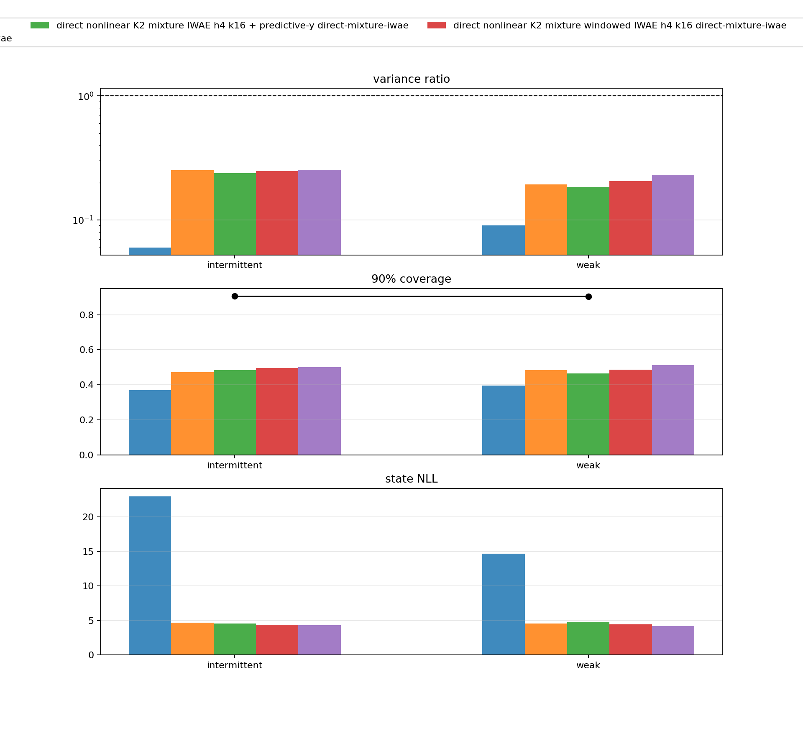

The nonlinear objective-repair branch left a clear gap: the best fully unsupervised strict Gaussian filter improved robustness, but still had weak coverage and very low variance ratios. The next branch tested whether that was an objective problem, a posterior-family problem, or a coupled problem.

The branch added:

- Gaussian mixture belief objects;
- direct K2 and K4 mixture update heads;
- multi-sample IWAE-style window objectives;
- FIVO-style bridge objectives and resampling diagnostics;
- local alpha and ADF-style projection objectives;
- comparison reports against particle-filter and grid references.

The headline constraint stayed the same. Fully unsupervised rows could use observations and the known generative model, but not grid moments, true latent states, reference variance targets, or posterior-shape targets.

## K2 Mixture IWAE

The K2 mixture IWAE follow-up was the cleanest early sign that posterior family and objective mattered together. On weak and intermittent observations, the direct K2 mixture windowed IWAE variants substantially improved state NLL and coverage relative to the promoted strict Gaussian baseline.

Aggregate rows from `outputs/nonlinear_direct_mixture_iwae_followup_1000`:

| Pattern | Model | state NLL | cov90 | var ratio |
|---|---|---:|---:|---:|
| intermittent | promoted strict Gaussian baseline | 22.992 | 0.371 | 0.060 |
| intermittent | K2 windowed IWAE h4 k16 | 4.414 | 0.497 | 0.247 |
| intermittent | K2 windowed IWAE h4 k32 | 4.335 | 0.501 | 0.254 |
| weak | promoted strict Gaussian baseline | 14.672 | 0.396 | 0.090 |
| weak | K2 windowed IWAE h4 k16 | 4.448 | 0.487 | 0.206 |
| weak | K2 windowed IWAE h4 k32 | 4.220 | 0.512 | 0.232 |

The result was not just a likelihood trick. Coverage and variance ratio moved in the right direction too. The filters were still not at grid-reference calibration, but the failure mode was much less severe than local ELBO or the earlier strict Gaussian objective repair.

## FIVO Bridge And Local Projection

The branch also tested FIVO-style paths. A direct FIVO objective without the bridge was poor in the initial pilot, with weak/intermittent NLLs in the tens. The FIVO bridge variants were much stronger:

| Suite | Pattern | Row | state NLL | cov90 | var ratio |
|---|---|---|---:|---:|---:|
| K2 FIVO bridge | weak | n16 | 2.899 | 0.765 | 0.485 |
| K2 FIVO bridge | intermittent | n16 | 2.938 | 0.742 | 0.450 |
| K2 local ADF | weak | beta 0.3 | 2.838 | 0.789 | 0.536 |
| K2 local ADF | intermittent | beta 0.3 | 2.847 | 0.782 | 0.523 |

These rows were reference-free under the training-signal rules, but they changed the algorithmic class: they looked less like amortized local ELBO training and more like structured local projection or filtering-objective design. That was useful. It showed that the model did not need hidden context to improve dramatically; it needed a better way to handle local nonlinear ambiguity.

## K4 Spread Candidates

K4 spread variants made the alias structure explicit by initializing components with \(2\pi\)-scale spread. The K4 Pareto report compared state-density and late predictive-y variants against a bootstrap particle filter reference.

| Pattern | PF n512 NLL | K4 spread NLL | K4 cov90 | K4 var ratio | K4 pred-y NLL |
|---|---:|---:|---:|---:|---:|
| intermittent | 3.140 | 2.640 | 0.786 | 0.619 | 0.362 |
| random normal | 4.288 | 3.278 | 0.747 | 0.477 | 0.575 |
| sinusoidal | 3.300 | 3.163 | 0.830 | 0.619 | 0.514 |
| weak | 2.946 | 2.724 | 0.918 | 1.082 | 0.329 |
| zero | 2.843 | 2.757 | 0.935 | 1.190 | 0.263 |

The late predictive-y row was a secondary Pareto candidate. It improved predictive-y NLL slightly, with state NLL cost no larger than `0.03`, but the gains were small relative to the remaining predictive gap.

## Interpretation

The week’s midpoint conclusion changed after these runs. The strict Gaussian objective-repair result was a partial success. The mixture and projection results showed something stronger:

> A reference-free nonlinear filter can get close to grid-scale state NLL when the update family and local projection objective respect the sine model’s alias structure.

The remaining gap moved from state density to predictive normalizer quality. Later diagnostics confirmed that the evaluator was already using exact mixture quadrature for predictive-y scoring, so the predictive gap was not just a Gaussian moment approximation artifact.

Source artifacts:

- [direct mixture IWAE follow-up](artifacts/direct_mixture_iwae_followup.md)
- [K4 Pareto report](artifacts/k4_pareto_report.md)

