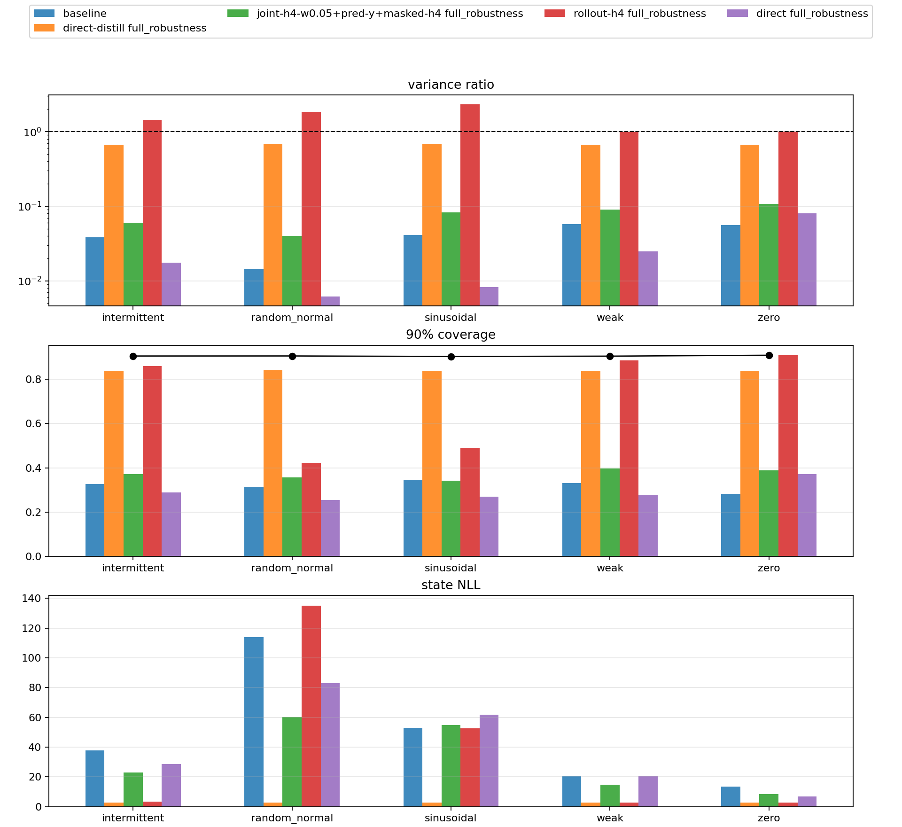

After the scalar benchmark, the work moved to a nonlinear sine-observation model:

\[
z_t = z_{t-1} + w_t,\quad w_t \sim \mathcal{N}(0,Q)
\]

\[
y_t = x_t \sin(z_t) + v_t,\quad v_t \sim \mathcal{N}(0,R)
\]

The strict filtering contract stayed the same:

\[
q^F_t = \operatorname{update}(q^F_{t-1}, x_t, y_t)
\]

No hidden sequence state was allowed in the headline rows. The filter had to export an explicit online filtering marginal at each time step.

## The Initial Failure

The first nonlinear branch established grid references, cached diagnostics, learned strict Gaussian filters, and stressor configs for weak, intermittent, zero, random-normal, and clean sinusoidal observations. The early fully unsupervised ELBO rows failed in a consistent way: they became too narrow, then self-fed the next update from a bad prior.

Reference-assisted rows showed that the architecture was not hopeless. Direct moment distillation from the grid reference reached state NLL near `2.77` with coverage near `0.84` across the robustness suite. A structured horizon-4 rollout distillation diagnostic also worked in weak and zero-observation settings. Those rows were useful controls, but they were not fully unsupervised.

The key diagnosis was narrower than "use a bigger model":

> A strict Gaussian target was not obviously doomed, because a moment-matched Gaussian projection of the grid posterior was much closer to the grid reference than the learned Gaussian.

That pointed at the objective before the posterior family.

## Objective Repair

The promoted unsupervised row combined three pieces:

```text
structured_joint_elbo_h4_w005_predictive_y_masked_y_spans_h4
```

The pieces had different jobs:

| Component | Purpose |
|---|---|
| short-window joint ELBO | make neighboring edge factors jointly explain a coherent latent path |
| causal predictive-y score | score \(y_t\) under the pre-assimilation belief before using \(y_t\) to update |
| masked-y span training | force the carried belief to survive missing or withheld measurements |

The windowed ELBO used the carried filtering marginal and learned backward conditionals to score a latent path against the generative model. For a window ending at \(s+H\), the posterior shape was:

\[
\begin{aligned}
q(z_{s-1:s+H})
&= q^F_{s+H}(z_{s+H})
\prod_{t=s}^{s+H} q^B_t(z_{t-1}\mid z_t)
\end{aligned}
\]

The important constraint was that the objective used only \(x\), \(y\), the known transition, the known observation model, and the prior. No grid moments or latent states were used for the headline row.



## Robustness Result

The final robustness run compared structured ELBO, direct ELBO, the promoted combined objective, and reference-distilled controls across five stressors with seeds `321,322,323`.

| Condition | structured ELBO NLL | promoted NLL | structured cov90 | promoted cov90 | promoted var ratio |
|---|---:|---:|---:|---:|---:|
| sinusoidal | 52.989 | 54.930 | 0.347 | 0.342 | 0.083 |
| weak sinusoidal | 20.865 | 14.672 | 0.332 | 0.396 | 0.090 |
| intermittent sinusoidal | 37.853 | 22.992 | 0.327 | 0.371 | 0.060 |
| zero | 13.474 | 8.414 | 0.282 | 0.388 | 0.107 |
| random normal | 113.958 | 60.109 | 0.315 | 0.358 | 0.040 |

This supported a partial-success claim. The candidate materially improved weak, intermittent, zero, and random-normal stressors. It also improved variance ratio on every condition in the table. But it regressed slightly on clean sinusoidal state NLL and coverage, and absolute calibration remained poor. The best fully unsupervised variance ratios stayed below `0.11`, far below the original `0.50` gate.

## What Changed After This

The objective repair did enough to justify continuing, but not enough to call the nonlinear filter solved. It also sharpened the next question:

1. Was the remaining failure caused by the ELBO-style divergence?
2. Was a single Gaussian posterior family too restrictive?
3. Did objective and posterior family have to change together?

That became the next branch: IWAE/FIVO-style multi-sample objectives, alpha/power-EP style updates, and small strict mixtures.

Source artifacts:

- [nonlinear unsupervised objective final report artifact](artifacts/nonlinear_unsupervised_objective_final_report/)
- [`fa4e94a`: final report aggregation in `ml-examples`](https://github.com/dwrtz/ml-examples/commit/fa4e94a989efc446ecaaed8cc4034a9a9b0ae2f2)
- [`8d6a9e`: windowed joint ELBO implementation](https://github.com/dwrtz/ml-examples/commit/8d6a9e3cf04be3863c5e22d04e3e63e5cebbf3ad)
- [`db13d4e`: predictive-y auxiliary objective](https://github.com/dwrtz/ml-examples/commit/db13d4e1e0a2354f50454b6db337fc859eafaf6a)
- [`423963e`: masked-y diagnostics](https://github.com/dwrtz/ml-examples/commit/423963e80904ed91e3e6dcdb2c04d27225042b8a)
- [`4ec6d94`: T11 robustness report](https://github.com/dwrtz/ml-examples/commit/4ec6d94610e64587c4a839d1c623b05d9e384dd0)
