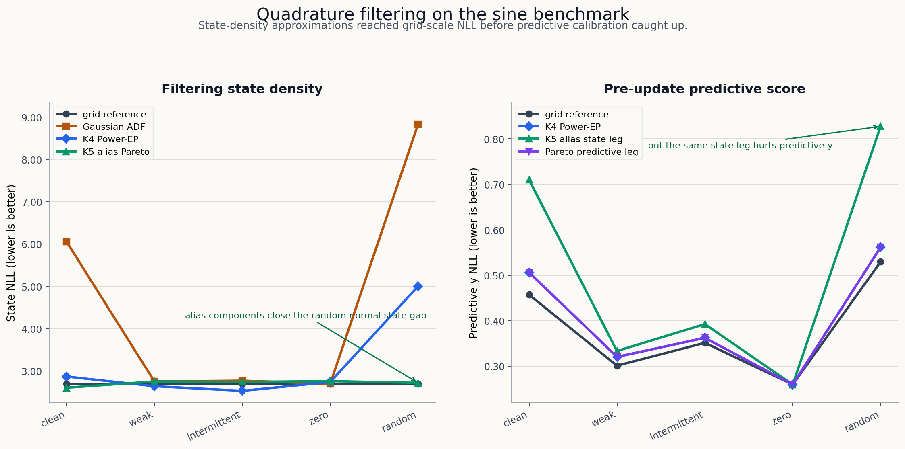

The last part of the week stepped away from amortized training and asked a sharper question:

> How far can a deterministic, reference-free filtering update go if it directly integrates the known nonlinear likelihood and projects the result back to a strict family?

That produced the quadrature ADF and Power-EP suite. These rows used only the known transition, known observation model, and observed \(x,y\). They did not train on grid posterior moments or latent states. The update locally formed a tilted distribution and projected it back to a Gaussian or Gaussian mixture.

The figure compares the deterministic quadrature rows from the committed sweep code against the grid-reference metrics. The left panel shows state-density quality; the right panel shows the pre-update predictive score, where the alias-heavy state update was less well calibrated.

## Baseline Quadrature ADF

The first suite compared a Gaussian ADF update, K2 ADF, K4 spread ADF, and K4 Power-EP with alpha `0.5`.

| Pattern | Grid ref NLL | Gaussian ADF | K4 ADF spread | K4 Power-EP alpha 0.5 |
|---|---:|---:|---:|---:|
| sinusoidal | 2.691 | 6.054 | 6.840 | 2.867 |
| weak | 2.692 | 2.749 | 2.648 | 2.638 |
| intermittent | 2.695 | 2.769 | 2.674 | 2.528 |
| zero | 2.693 | 2.693 | 2.736 | 2.736 |
| random normal | 2.698 | 8.834 | 8.976 | 5.002 |

The result was uneven but important. K4 Power-EP closed most of the state-density gap in clean, weak, intermittent, and zero-observation settings. Random-normal observations remained difficult.

## Alias-Indexed Components

The sine likelihood creates alias modes. The next variants indexed mixture components by \(2\pi\)-spaced aliases and then tested prior weighting, top-k pruning, moment shrinkage, and entropy gates.

The prior-weighted K5 alias Power-EP row improved random-normal state NLL from `5.002` to `2.717`, close to the grid reference `2.698`, but it inflated variance and damaged predictive-y NLL:

| Pattern | K5 alias state NLL | ref state NLL | cov90 | var ratio | pred-y NLL | ref pred NLL |
|---|---:|---:|---:|---:|---:|---:|
| sinusoidal | 2.602 | 2.691 | 0.924 | 1.533 | 0.710 | 0.457 |
| weak | 2.750 | 2.692 | 0.968 | 1.562 | 0.334 | 0.301 |
| intermittent | 2.739 | 2.695 | 0.962 | 1.549 | 0.393 | 0.351 |
| zero | 2.758 | 2.693 | 0.969 | 1.585 | 0.260 | 0.260 |
| random normal | 2.717 | 2.698 | 0.888 | 2.011 | 0.827 | 0.530 |

Shrink variants fixed some overdispersion. For weak, intermittent, and zero observations, shrink `0.85` brought variance ratio near one:

| Pattern | shrink state NLL | cov90 | var ratio |
|---|---:|---:|---:|
| weak | 2.687 | 0.913 | 0.998 |
| intermittent | 2.683 | 0.909 | 0.994 |
| zero | 2.695 | 0.916 | 1.016 |

The tradeoff was that shrink hurt sinusoidal and random-normal state NLL. That made it a calibration variant, not the overall promotion row.

## State-Predictive Pareto Split

The final quadrature Pareto suite separated a state-density leg from a predictive leg. It paired the prior-weighted K5 alias state update with the K4 Power-EP predictive scorer:

| Pattern | Pareto state NLL | Pareto pred-y NLL | cov90 | var ratio |
|---|---:|---:|---:|---:|
| sinusoidal | 2.602 | 0.506 | 0.924 | 1.533 |
| weak | 2.750 | 0.321 | 0.968 | 1.562 |
| intermittent | 2.739 | 0.362 | 0.962 | 1.549 |
| zero | 2.758 | 0.260 | 0.969 | 1.585 |
| random normal | 2.717 | 0.561 | 0.888 | 2.011 |

This was not a single perfect filter. It was a useful decomposition: the state-density update and predictive normalizer wanted different approximations. That matched the later predictive-decomposition report, where K4 state-density rows had strong state NLL but still lagged the particle-filter predictive likelihood on clean and random-normal patterns.

## What This Says About The Week

The week started with an amortized VBF implementation question and ended with a stronger algorithmic diagnosis:

- local ELBO was too mode-seeking and under-dispersed;
- combined unsupervised objective repair helped but did not solve calibration;
- mixture IWAE, FIVO bridge, and local projection rows showed that reference-free updates could improve dramatically;
- deterministic quadrature and Power-EP made the alias structure explicit and reached grid-scale state NLL on several stressors.

The remaining research target is not just "make the posterior bigger." It is to align state-density quality with the pre-update predictive normalizer, while preserving the strict online filter.

Source artifacts:

- [quadrature ADF suite](artifacts/quadrature_adf_suite.md)
- [alias entropy shrink suite](artifacts/alias_entropy_shrink_suite.md)
- [quadrature Pareto suite](artifacts/quadrature_pareto_suite.md)
- [`59f084f`: quadrature ADF nonlinear baselines](https://github.com/dwrtz/ml-examples/commit/59f084f)
- [`78d5ba7`: alias-indexed quadrature filter experiment](https://github.com/dwrtz/ml-examples/commit/78d5ba7)
- [`7d88e2e`: prior-weighted alias quadrature experiment](https://github.com/dwrtz/ml-examples/commit/7d88e2e)
- [`c1ff610`: quadrature Pareto sweep](https://github.com/dwrtz/ml-examples/commit/c1ff610)
- [`c49c7fa`: entropy-gated alias shrink variants](https://github.com/dwrtz/ml-examples/commit/c49c7fa)
