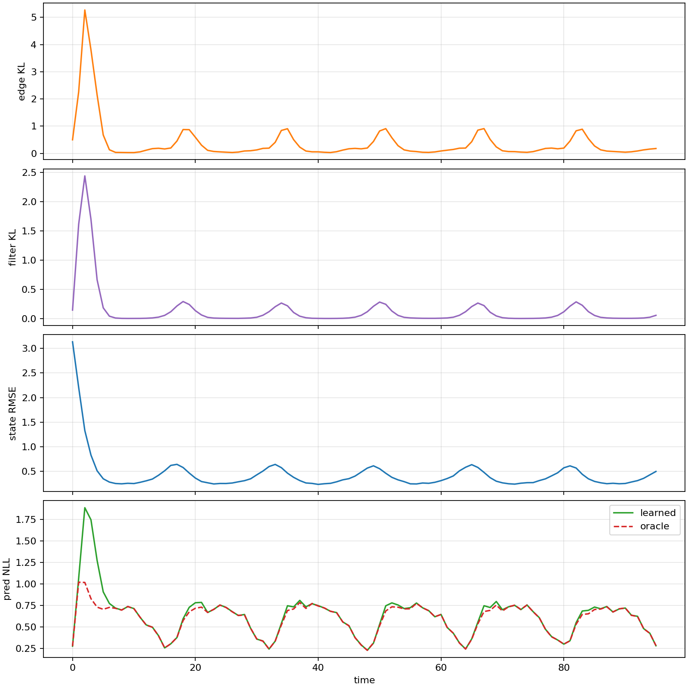

This week started by rebuilding the variational Bayesian filtering experiments around a scalar linear-Gaussian state-space model. The goal was not to win on a toy problem. The goal was to make the mechanics testable before asking nonlinear questions:

\[
z_t = z_{t-1} + w_t,\quad w_t \sim \mathcal{N}(0, Q)
\]

\[
y_t = x_t z_t + v_t,\quad v_t \sim \mathcal{N}(0, R)
\]

The filter carried a strict online marginal \(q^F_t(z_t)\) plus an edge/backward conditional \(q^B_t(z_{t-1} \mid z_t)\). That made the posterior edge factor explicit:

\[
q^E_t(z_t,z_{t-1}) = q^F_t(z_t)q^B_t(z_{t-1} \mid z_t)
\]

The immediate implementation work created JAX training and evaluation paths, analytic Kalman references, posterior diagnostics, predictive metrics, and plotting under `src/vbf/`, `scripts/`, and `experiments/linear_gaussian/`.

## What Had To Be True

The linear-Gaussian benchmark gave us closed-form answers. That allowed several checks which are hard to get in the nonlinear case:

- exact Kalman filtering should reach 90 percent coverage near `0.90`;
- a frozen marginal control should preserve the exact filtering marginal while learning only the backward edge;
- supervised edge heads should not be mistaken for an unsupervised result;
- Monte Carlo ELBO variants should be separated from oracle-calibrated diagnostics.

The frozen marginal control was especially important. It showed that the edge/backward conditional could be learned while the filtering marginal remained exact. In the five-seed diagnostic baseline, the frozen marginal row had state NLL `0.401983`, coverage `0.900220`, and variance ratio `1.000006`, matching the exact Kalman marginal.

## What The Sweeps Found

The scalar report split results into weak-observability and randomized \(Q/R\) regimes.

| Regime | Strong reference | Learned row | Main result |
|---|---|---|---|
| nominal sinusoidal \(x_t\) | exact Kalman state NLL `0.402` | self-fed supervised state NLL `0.415` | supervised residualized filter was close |
| weak sinusoidal | exact Kalman state NLL `1.175` | MC ELBO state NLL `1.291` | unsupervised MC ELBO was under-dispersed |
| zero unobservable | exact Kalman state NLL `2.740` | MC ELBO state NLL `7.010` | local ELBO collapsed variance badly |
| randomized \(Q/R\) | frozen marginal matched Kalman | regime-local supervised was near reference | generalization needed explicit regime calibration |

The most useful negative result was that direct non-residualized ELBO training was weak. The strong rows depended on preserving analytic structure: residualized updates, frozen exact marginal controls, or oracle/reference calibration. That shaped the later nonlinear work: when results were good, the report had to say whether they were fully unsupervised or assisted by reference information.

## ELBO And Predictive Checks

The MC ELBO ablation behaved smoothly in the scalar case. Increasing samples improved state NLL from `0.575477` at one sample and 1000 steps to `0.542554` at 32 samples and 1000 steps. It still did not match exact Kalman state NLL `0.401983`.

The predictive head experiment was a separate caution. With only short training it was poor, but at 3000 steps a learned predictive head on oracle belief reached predictive NLL `0.625870`, close to exact Kalman predictive NLL `0.600858`. A learned head on the ELBO belief reached `0.670554`, while the analytic predictive from the same ELBO belief was `0.640331`.

The interpretation was simple: the predictive machinery could be learned, but it was not a free substitute for a calibrated belief.

## Why This Mattered

The linear-Gaussian work made the later nonlinear reports stricter. The important labels were:

| Label | Meaning |
|---|---|
| `unsupervised` | training used observations, known transition, known observation model, and prior |
| `reference_distilled` | training used grid/reference moments, densities, or rollout targets |
| `oracle_calibrated` | training used reference variance targets or oracle posterior statistics |

That labeling became the backbone of the nonlinear series. The scalar benchmark was ready once the report could say: self-fed supervised and frozen-marginal controls are useful diagnostics, but vanilla unsupervised ELBO remains under-dispersed in the regimes that matter.

Source artifacts:

- [linear Gaussian final report](artifacts/linear_gaussian_final_report.md)
- [linear Gaussian ELBO ablation](artifacts/linear_gaussian_elbo_ablation.md)
