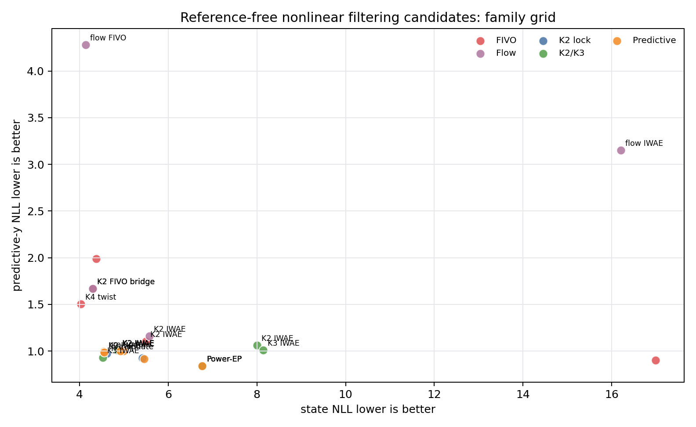

A Kalman filter is a beautiful bargain. If the dynamics and observations are
linear and Gaussian, the filtering distribution stays Gaussian forever:

\[
\begin{aligned}
q^F_t(z_t) &= p(z_t \mid y_{1:t}) \\
&= \mathcal{N}(m_t, P_t).
\end{aligned}
\]

Each update carries only a mean and variance. The filter is online, cheap, and
exact.

This project asks how far we can keep that bargain after the observation model
becomes nonlinear. The constraint is intentionally strict:

\[
q^F_t = \operatorname{update}(q^F_{t-1}, x_t, y_t).
\]

No hidden smoothing posterior. No full-sequence transformer that peeks at future
observations. No reference posterior targets at training time. The learned
filter must produce a usable online filtering marginal after each observation.

The nonlinear benchmark here uses scalar latent dynamics with observations such
as sine, heavy-tailed, tanh, and cubic variants. The hard case is not state
dimension. It is posterior shape: nonlinear observations can alias multiple
latent states into the same measurement, so a single Gaussian filter can become
overconfident in the wrong shape.

## What We Measured

The main metrics were:

- **state NLL**: negative log density of the true latent state under the learned
  filtering marginal \(q^F_t(z_t)\). Lower is better.
- **predictive-y NLL**: negative log probability of the next observation under
  the one-step predictive normalizer. Lower is better.
- **90% coverage**: whether the learned moment interval covers the true latent
  state.
- **variance ratio**: learned filter variance relative to the grid reference.

For each candidate family, the experiments used 3 seeds and 1000 training
steps. GPU sweeps ran on a Lambda A10 VM with 12 concurrent workers. The source
artifacts are included at the end of this post.

## Step 0: Lock A K2 Baseline

The first question was whether a small mixture already fixes the worst failure.
It did. A direct K2 Gaussian mixture trained with a windowed IWAE objective
became the clean reference-free baseline.

| model | state NLL | pred-y NLL | cov90 |
|---|---:|---:|---:|
| K2 IWAE + pre-update predictive scoring | 4.614 | 0.971 | 0.599 |
| K2 IWAE h4 k32 | 4.869 | 1.004 | 0.584 |
| K2 local ADF hybrid | 5.419 | 0.927 | 0.587 |
| K2 Power-EP | 6.764 | 0.841 | 0.640 |
| strict Gaussian baseline | 4159.987 | 3217.708 | 0.479 |

The strict Gaussian row is a useful reminder: once the posterior is not close to
Gaussian, a locally reasonable update can be catastrophically wrong as a density
model. The K2 mixture is still tiny, but it can represent the two-way aliasing
that appears in sine-like observations.

The objective matters too. The IWAE objective uses multiple samples from the
learned edge posterior and optimizes a tighter bound:

\[
\begin{aligned}
\log p(y_{t-h+1:t})
&\gtrsim \log \frac{1}{K}
\sum_{k=1}^K w_k,
\end{aligned}
\]

where the weights score sampled latent paths under the model and divide by the
learned proposal. For a Kalman-filter reader, this is the same instinct as
checking whether the proposed posterior explains both the transition and the
measurement, but now with Monte Carlo paths rather than closed-form Gaussian
updates.

## Step 1: More Components Help, Exchangeability Did Not

K3 improved the K2 baseline modestly:

| model | state NLL | pred-y NLL | cov90 |
|---|---:|---:|---:|
| K3 mixture IWAE h4 k32 | 4.525 | 0.931 | 0.603 |
| K2 mixture IWAE h4 k32 | 4.859 | 1.008 | 0.584 |
| exchangeable K2 mixture IWAE h4 k32 | 8.002 | 1.064 | 0.593 |
| exchangeable K3 mixture IWAE h4 k32 | 8.146 | 1.011 | 0.592 |

The interpretation is narrow. Component count still matters, but the explicitly
exchangeable parameterization was not automatically better. Symmetry is a good
principle, but this implementation inflated variance and lost state density.

So the next move was not "make K larger." It was to ask whether the remaining
problem was predictive consistency.

## Step 2: Predictive Consistency Was Not A Free Lunch

A filtering distribution should do two jobs:

\[
q^F_t(z_t) \approx p(z_t \mid y_{1:t})
\]

and it should imply a good next-observation normalizer:

\[
\begin{aligned}
p(y_t \mid y_{1:t-1})
&= \int p(y_t \mid z_t) \\
&\quad p(z_t \mid y_{1:t-1})\,dz_t.
\end{aligned}
\]

The Step 2 experiments added pre-update predictive scoring and late
predictive-y penalties. The result was mostly negative:

| model | state NLL | pred-y NLL | cov90 |
|---|---:|---:|---:|
| K2 IWAE + pre-update predictive scoring | 4.548 | 0.998 | 0.602 |
| K2 IWAE h4 k32 | 4.557 | 0.987 | 0.601 |
| K2 IWAE + late predictive-y w0.3 | 4.925 | 1.001 | 0.577 |
| detached pre-update predictive scoring | 4.988 | 1.002 | 0.578 |
| K2 local ADF hybrid | 5.456 | 0.916 | 0.586 |

Pre-update predictive scoring tied the baseline on state density but did not
improve predictive-y. The stronger predictive-y variants moved along the same
tradeoff curve rather than resolving it.

That is a useful result. It says the gap is not simply "we forgot to score the
normalizer." The learned posterior family and proposal dynamics still matter.

## Step 3: FIVO Was More Useful As A Diagnostic

FIVO is a variational sequential Monte Carlo objective. It trains a proposal by
running particles through time, reweighting them by the generative model, and
using the particle marginal-likelihood estimate as the learning signal.

For a Kalman-filter reader, a particle filter is what you reach for when
Gaussian algebra is no longer enough. FIVO takes that particle-filter estimator
and differentiates through the proposal family.

The diagnostic quantities were effective sample size and log-weight variance.
High ESS means the proposal is not wasting most particles.

| model | state NLL | pred-y NLL | cov90 | mean ESS |
|---|---:|---:|---:|---:|
| K4 FIVO fixed-lag twist h4 | 4.026 | 1.505 | 0.643 | 23.058 |
| K2 FIVO bridge n32 | 4.299 | 1.669 | 0.562 | 23.012 |
| K2 IWAE h4 k32 | 5.495 | 1.103 | 0.543 | n/a |
| K2 FIVO n32 | 16.986 | 0.901 | 0.441 | 12.174 |

Plain FIVO improved predictive-y only by collapsing state density. The bridge
proposal was the important row. On weak and intermittent stressors, it was much
stronger:

| model | state NLL | pred-y NLL | cov90 | mean ESS |
|---|---:|---:|---:|---:|
| K2 FIVO bridge n32 | 3.111 | 0.367 | 0.697 | 28.936 |
| K4 FIVO fixed-lag twist h4 | 3.359 | 0.368 | 0.643 | 27.798 |
| K2 IWAE h4 k32 | 5.623 | 0.367 | 0.458 | n/a |
| K2 FIVO n32 | 33.581 | 0.343 | 0.226 | 14.044 |

This justified one careful flow experiment. The diagnostics suggested that
proposal shape and posterior shape might be the remaining bottleneck.

## Step 4: A Scalar Flow Helped State Density, But Hurt Prediction

The flow pilot was deliberately modest. The filtering marginal was:

\[
\begin{aligned}
u &\sim \mathcal{N}(0,1), \\
z_t &= \ell_t + s_t S_t(u),
\end{aligned}
\]

where \(S_t\) is a learned monotone piecewise-linear scalar spline. The model
can evaluate exact density by change of variables:

\[
\begin{aligned}
\log q^F_t(z_t)
&= \log \mathcal{N}(u;0,1) \\
&\quad - \log \left|\frac{dz_t}{du}\right|.
\end{aligned}
\]

This is not a hidden smoother. The MLP still emits flow parameters online from
the previous filtering moments and the current observation.

The family-grid result:

| model | state NLL | pred-y NLL | cov90 | var ratio |
|---|---:|---:|---:|---:|
| scalar-flow FIVO bridge n32 | 4.136 | 4.283 | 0.755 | 22.392 |
| K2 mixture FIVO bridge n32 | 4.296 | 1.670 | 0.570 | 0.924 |
| K2 mixture IWAE h4 k32 | 5.578 | 1.159 | 0.545 | 0.952 |
| scalar-flow IWAE h4 k32 | 16.206 | 3.149 | 0.438 | 1.316 |

Flow+FIVO bridge slightly improved state NLL and substantially increased
coverage, but the variance ratio exploded and predictive-y got much worse,
especially on cubic observations. Flow+IWAE was unstable.

This is the most important negative result in the sequence. Richer marginals do
not automatically solve nonlinear filtering. They can make the density broader
and improve coverage while breaking the predictive normalizer.

## Current Takeaway

The best current mental model is:

1. The strict Gaussian failure was mostly posterior-shape mismatch.
2. A small K2/K3 mixture fixes much of that while preserving online filtering.
3. Predictive consistency is not solved by simply adding a predictive-y term.
4. FIVO bridge is a useful diagnostic and a strong stressor candidate.
5. Scalar flows are plausible, but need variance or predictive-normalizer
   regularization before they are worth promoting.

The practical frontier is still not "the most expressive posterior wins." It is
"the posterior family, proposal, and objective have to agree about what the
filter is for."

## What I Would Do Next

I would not start a broad new architecture branch yet. The next useful step is a
write-up and a small targeted follow-up:

- Keep K2/K3 mixture IWAE as the clean baseline.
- Keep K2 FIVO bridge as the diagnostic/stressor candidate.
- If continuing flows, test only flow+FIVO bridge with explicit variance or
  predictive-normalizer control.
- Otherwise, turn this into a publishable research arc before adding more model
  families.

Source artifacts:

- [K2 Pareto lock report](artifacts/k2_pareto_lock_2026-05.md)
- [Exchangeable K2/K3 report](artifacts/exchangeable_k2k3_strict_mixture_2026-05.md)
- [Predictive-consistency report](artifacts/predictive_consistent_mixture_objectives_2026-05.md)
- [VSMC/FIVO diagnostics report](artifacts/vsmc_fivo_diagnostics_2026-05.md)
- [Scalar-flow pilot report](artifacts/scalar_flow_filtering_pilot_2026-05.md)
- [`sweep_nonlinear_learned.py`](https://github.com/dwrtz/ml-examples/blob/master/scripts/sweep_nonlinear_learned.py)
- [`train_nonlinear.py`](https://github.com/dwrtz/ml-examples/blob/master/scripts/train_nonlinear.py)
- Prior context: [When Mixtures Beat Local ELBO In Nonlinear Filtering](/posts/mixture-iwae-filtering-branch/)
