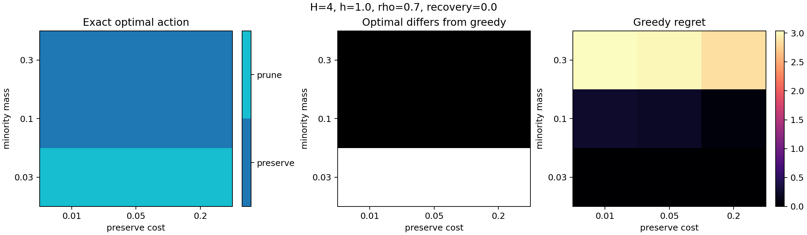
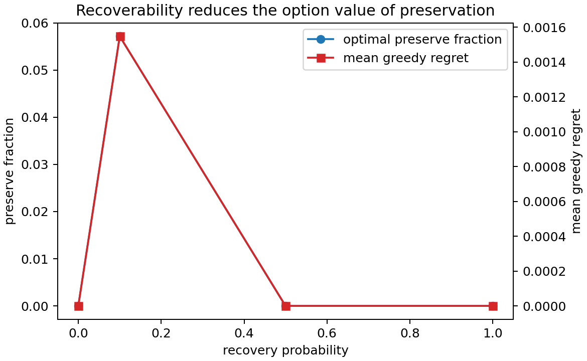

A Bayesian filter does not merely update a probability distribution. A
resource-bounded filter also decides what that distribution will look like
after the update: one Gaussian or several, aggressively merged or carefully
preserved, cheap to carry or expensive to retain.

That makes posterior approximation a control problem. Compressing now may be
harmless if future observations can reconstruct what was lost. The same
compression may be disastrous if a weak but plausible mode is the only path to
interpreting a later observation correctly.

Our first controlled-projection cycle found real evidence for that option
value. It also found a sharp boundary around the result:

> Projection choice matters in exact and full-information experiments, but
> those experiments do not by themselves supply a usable online policy.

This post covers the positive half of the story. The next post explains why
[the oracle could choose while the online planner could not](/posts/oracle-vs-online-planner/).

The implementation, generated tables, and complete claim audit live in
[`dwrtz/ml-examples`](https://github.com/dwrtz/ml-examples), with the
[first-cycle synthesis](https://github.com/dwrtz/ml-examples/blob/ddc9215/docs/results/current/controlled_belief_projection_2026-08.md)
at source commit [`ddc9215`](https://github.com/dwrtz/ml-examples/commit/ddc9215).

## Projection is an action

Let \(p\) be the high-fidelity filtering belief and let \(q_a\) be the bounded
belief produced by projection action \(a\). A simple one-step objective is

\[
J_1(a;p) = D_{\mathrm{KL}}(p\Vert q_a) + \lambda C(a),
\]

where \(C(a)\) is measured computation. A greedy controller chooses the action
with the smallest immediate distortion-plus-work score.

But the best current approximation need not be the best state to carry into the
future. A horizon-\(H\) controller cares about all later filtering losses and
work:

\[
J_H(a_0;p_0) = \mathbb E\left[\sum_{t=0}^{H-1}
D_{\mathrm{KL}}(p_t\Vert q_t) + \lambda C(a_t)\right].
\]

The action library in the scalar experiment ranged from a cheap single-Gaussian
assumed-density update to tempered three-component updates and a richer
five-component branch-and-reduce operator. Every action emitted the same
bounded five-slot mixture representation, so later controllers could compare
them without changing the state interface.

The question was not “are more components better?” It was “which projection is
worth its cost in this belief state, given what may happen next?”

## An exact model makes the mechanism visible

We first removed neural approximation, continuous integration, and Monte Carlo
planning from the problem. The exact model has two physical hypotheses, a
bounded approximate belief, preserve and prune actions, a finite budget,
stochastic recovery, noisy probes, and a costly final decision. Backward dynamic
programming was checked against brute-force tree enumeration.

Across an initial 324-state grid, the exact policy disagreed with a greedy
policy in 20 states. The largest greedy regret was 3.0392. It also disagreed
with the specified rollout approximation in nine states and with the causal
information state in three.

The white region in the center panel marks states where looking ahead changes
the action. In the displayed slice, the difference appears when the minority
hypothesis is small enough for greedy compression to look attractive but still
large enough to matter after a later probe.

A narrower staged confirmation enumerated 108 states. It retained two
exact-versus-greedy disagreements and one full-information-versus-causal
disagreement. The maximum greedy regret fell to 0.0953, which is a useful
reminder: the mechanism is exact, but its size depends on the model slice.

| Exact finite model | States | Exact vs greedy | Exact vs rollout | Full-information vs causal |
|---|---:|---:|---:|---:|
| Broad screen | 324 | 20 | 9 | 3 |
| Staged confirmation | 108 | 2 | 1 | 1 |

Recoverability is the key qualifier. If a future observation can cheaply
reconstruct a pruned hypothesis, preserving it today has less option value.
That relationship appears in the exact confirmation, but only in a small
slice; it should not be read as a universal response curve.

The exact experiment therefore establishes existence, not prevalence. There
are coherent states where preserving a currently inconvenient possibility is
optimal because it changes what the filter can do later.

## The scalar benchmark keeps the choice nontrivial

The continuous testbed used six families of scalar nonlinear-filtering
problems. Some preserve an exact periodic ambiguity. Some introduce a delayed
linear or hyperbolic-tangent observation that resolves it. Others break aliases
through dynamics, create new modes from a broad prior, or vary how easily a
weakened mode can recover.

No projection action dominated all mechanism states. The richer five-component
operator had the lowest mean 16-step damage among the retained actions, but it
also used roughly 19,416 work units per state. The cheap transition-only and
single-Gaussian actions used 216. The three tempered updates occupied the
middle in distortion and cost.

That frontier contained stable ranking reversals between immediate and
16-step damage. In other words, the action that best approximated the current
belief was sometimes not the one that produced the best downstream filtering
state.

## Full information finds large one-step adaptive value

The scalar oracle evaluated all six actions against the exact grid belief at
each decision state. “Full information” is literal here: the policy reads a
reference representation that a deployable filter does not possess.

For one-step decisions, state-dependent oracle selection beat the best locked
fixed action in both information settings:

| Comparison | Decision states | Adaptive cost | Fixed cost | Relative gain | 95% CI for absolute gain |
|---|---:|---:|---:|---:|---:|
| Known schedule | 128 | 0.2945 | 0.4839 | 39.1% | [0.1403, 0.2385] |
| Stochastic hazards | 68 | 0.2628 | 0.4941 | 46.8% | [0.1430, 0.3195] |

A frequency-matched random policy was far worse, with relative gaps of 68.9%
and 72.7%. The gain therefore was not an artifact of how often the oracle used
each action. It depended on choosing different actions in different states.

This is strong mechanism evidence: projection value is state dependent, and an
exact-grid decision rule can exploit it. It is not a deployment result because
the exact grid is privileged information.

## Four-step lookahead did less than expected

The nonmyopic question was harder. A four-step, full-information
one-step-deviation rollout was compared with repeatedly applying the same
full-information greedy rule.

| Information setting | Four-step rollout cost | Repeated greedy cost | Relative gain |
|---|---:|---:|---:|
| Known schedule | 1.0324 | 1.0787 | 4.29% |
| Stochastic hazards | 0.8363 | 0.8522 | 1.86% |

Both effects were positive, but the experiment had declared a 5% gate before
promotion. Neither result passed it. The family pattern also failed the proposed
delayed-disambiguation test: in the known-schedule audit, an exact-symmetry
control exceeded 5% while the recoverability-controlled delayed family did
not; under stochastic hazards, both delayed families stayed below 5%.

So the defensible statement is narrower than “lookahead works.” The experiment
found a small efficiency effect over an already adaptive greedy oracle. It did
not establish a continuous-filter analogue of the large exact option-value
regime, and it did not justify longer-horizon confirmation.

## Three conclusions, kept separate

The cycle supports three increasingly weak claims:

1. **Exact mechanism:** finite belief preservation can have genuine option
   value. This is established for the enumerated toy model.
2. **State-dependent scalar projection:** exact-grid information supports large
   one-step adaptive gains over fixed projection. This is oracle mechanism
   evidence.
3. **Nonmyopic scalar planning:** the tested four-step full-information rollout
   adds only a small, sub-threshold improvement over repeated greedy selection.

Those distinctions matter. “Projection choice matters” survives the cycle.
“Long-horizon planning is the reason” does not.

The next engineering question was whether an online filter could recover the
oracle’s action choices from its bounded belief state. Before learning that
mapping, we tried the more direct route: simulate causal futures from the
approximate belief and plan online. That is where the clean mechanism met the
cost and information constraints of deployment.
