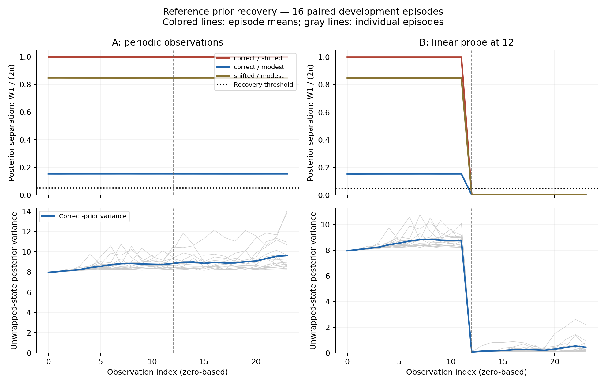
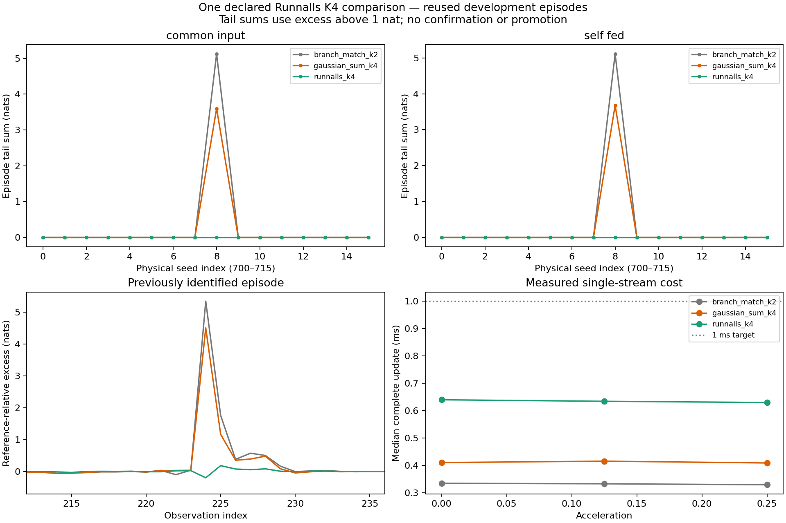

A four-Gaussian Bayesian filter tracked a switching motion model well on average.
It also assigned much too little density to the realized state at one observation.
We traced that miss to the way it merged Gaussian components, then tested one
classical replacement. The large miss disappeared, and the replacement stayed
within the time and memory budgets.

We still did not nominate it for confirmation. A separate, previously declared
guardrail failed. The increase was small and did not demonstrate material
tracking harm, but the rule required every check to pass.

The useful result is the combination: a measured compression mechanism, an
intervention that addressed it, and a stopping decision that preserved both
the benefit and the remaining failure.

*The cover shows the original miss: a slice of joint log density at the realized
position and regime. It is an offline diagnostic, not a marginal density or
information available to the filter.*

## First, ask what the observations can reveal

A Bayesian filter carries a distribution over a hidden state as observations
arrive. A bounded filter also has to compress that distribution into a small,
fixed amount of memory. Poor results can therefore have different causes: the
observations may leave uncertainty unresolved, or the approximation may lose
information that a more accurate filter retains.

After our [earlier learned-controller experiments](/posts/useful-offline-harmful-online/),
we tested this distinction before investing in another learned method. The
study used two matched scalar problems and one independent motion problem.
All were simulations with known generative parameters.

In the scalar pair, the hidden state is an unwrapped random walk. The first
sensor measures its sine plus Gaussian noise. The second is identical except
for one absolute, linear observation at index 12. A sine reading cannot
distinguish a state from the same state shifted by a full period; the linear
reading breaks that symmetry.

We filtered each stream from three initial priors: \(N(0,8)\),
\(N(2\pi,8)\), and \(N(1,8)\). Here the second parameter is variance.
There were 16 paired physical episodes, each with 24 observations, process and
sensor variances 0.1, and an observation of the initial state at index zero.

The numerical reference recovered from the different priors in **16/16**
episodes with the linear probe and **0/16** with only periodic observations.
Recovery required normalized Wasserstein distance \(W_1/(2\pi)\) at most
0.05 for three consecutive observations starting at or after the probe, with
no later exceedance through the horizon.



The correctly initialized reference's postprobe state RMSE was 3.348 for the
periodic sensor and 0.394 with the probe. Yet its final uncertainty about the
observed sine signal was almost identical. Accurate signal estimation can
coexist with substantial uncertainty about absolute location. That uncertainty
is part of the task, rather than evidence of a broken filtering implementation.

This conclusion is specific to replacing one sine reading with a linear
reading. We did not run an equal-information stronger-sine comparison.

## Recovery was possible, but the bounded filters did not always achieve it

The next comparison used four fixed classical approximations. A single Gaussian
used moment matching; mixtures used Gauss–Hermite integration and weighted
expectation-maximization updates. K denotes retained component capacity and Q
denotes quadrature order. Prediction and the linear observation used analytic
Gaussian-mixture operations.

| Method | Recovery to the correct reference after the probe | Correct-prior postprobe RMSE | Correct-prior 90% coverage |
|---|---:|---:|---:|
| Numerical reference | 16/16 | 0.394 | 92.19% |
| Single Gaussian, K1/Q128 | 10/16 | 0.673 | 82.81% |
| Mixture, K4/Q128 | 14/16 | 0.398 | 91.67% |
| Mixture, K4/Q256 | 14/16 | 0.398 | 91.15% |
| Mixture, K8/Q128 | 14/16 | 0.396 | 92.19% |

Recovery requires all three approximate initializations to approach the
correctly initialized reference. The accuracy columns use only the correct
prior. Their favorable means do not erase failures from other initializations.

Both K4 rows failed on the same two episodes. Doubling quadrature preserved
every recovery classification and delay. K8 also recovered in 14/16, with one
different failure and a whole-episode median update time of about 1.32 ms on
the probe problem, above the provisional 1 ms target.

Agreement among approximations is also insufficient: the single-Gaussian row
had eight postprobe observations across three episodes where the different
priors agreed but failed the correct-reference proximity test. All censored
episodes remain counted. The [full scalar recovery table](artifacts/scalar-recovery.csv)
keeps these endpoints separate.

This establishes an approximation limitation under recoverable observations.
It does not yet tell us whether the remaining scalar error comes from numerical
integration, compression, or information lost earlier in the trajectory.

## A motion model made compression easier to isolate

The independent problem tracks position, velocity, and a hidden acceleration
sign from noisy position readings. It uses known linear dynamics, Gaussian
noise, a regime-switching probability of 0.03, and acceleration magnitudes
0, 0.125 and 0.25. Each setting has the same 16 paired physical seeds and
256 observations. The first observation follows a state transition.

Conditional on the regime, a Kalman update is analytic. From a four-component
carry, branching over the next regime produces at most eight Gaussians. The
compression step must reduce them back to at most four. This exposes a clean
comparison between an exact local update and the distribution actually carried.

The classical pilot included an interacting multiple-model filter, exact
branching followed by moment matching, Gaussian sums, and informed
Rao–Blackwellized particle filters. The named long-history reference used
16,384 particles, replicate 0. It passed checks against short exact enumeration,
alternative particle budgets and random seeds, and selected deterministic
Gaussian-sum references.

The existing K4 Gaussian sum performed well on average. Its mean excess joint
log loss was -0.000254 nats per observation at acceleration 0.125 and +0.000518
at acceleration 0.25. It matched the reference's 101/127 and 108/127 recovered
regime changes. These are events within 16 episodes, not 127 independent trials.

But one previously identified observation had **4.511265 nats** of excess
joint log loss. At that observation, the exact local update had excess
-0.007773 nats. Compression itself contributed 4.519038 nats. The four
validated reference scores spanned only 0.007944 nats there.

Two rare branches carried about 1.21% of total probability but supplied
99.944% of the exact candidate's joint density at the realized truth. The
existing velocity-bin rule merged them with a much heavier branch. It
preserved regime mass, means and covariances while sharply reducing density
in that separated region—the effect shown in the cover.

This was a diagnosis of one known episode. Only two observations in that
episode exceeded one nat; every other episode maximum at acceleration 0.25
was below 0.5 nats. It was not a discovery of frequent independent tail failures.

## One geometric merge rule, tested locally and recursively

We declared one replacement based on [Runnalls' Gaussian-mixture reduction criterion](https://kar.kent.ac.uk/2782/).
It uses an efficiently computed KL bound to select pairs for moment-preserving
merges. Our implementation uses full two-dimensional covariances, recomputes
eligible pair costs after every merge, and retains at most two Gaussians per
regime. It has no truth-dependent merge choice, cross-regime merge, pruning,
or probability floor.

Both comparisons matter:

- **Common inputs:** apply every compressor to the same exact candidate from
  the unchanged existing K4 filter. Only that original filter advances.
- **Self-fed filtering:** each method constructs the next candidate from its
  own preceding compressed belief, so its errors can propagate.

For self-fed runs, define realized excess as
\(E_t=\log p_t-\log q_t\), where p is the reference density and q is the
carried joint density, evaluated at the realized state and regime. The
episode tail sum is

\[
S=\sum_t\max(E_t-1,0).
\]

On common inputs, replace the reference with the exact local candidate. These
are realized log-density contrasts; they are not estimates of KL divergence.

| Acceleration 0.25 | Existing K4 | Runnalls K4 |
|---|---:|---:|
| Mean episode tail sum, common inputs | 0.224760 | 0 |
| Mean episode tail sum, self-fed | 0.229923 | 0 |
| Maximum episode tail sum, self-fed | 3.678761 | 0 |
| Maximum step excess, self-fed | 4.511265 | 0.412746 |
| Episodes with excess above one nat | 1/16 | 0/16 |
| Median complete update | 0.409 ms | 0.630 ms |
| Maximum retained algorithm state | 2,235 bytes | 2,235 bytes |

Tail sums and excess are in nats. Runnalls grouped the nearby heavy branches
together and retained the rare pair as a separate Gaussian on the common
candidate. Its own recursive trajectory also removed the large miss.



The gray K2 row is native moment matching with one Gaussian per regime.
All tail-sum benefit in this comparison comes from the already inspected
episode. Tracking and regime recovery remain close to existing K4. Zero
observed tail episodes does not establish zero future risk.

Across all settings, Runnalls' median update was 0.630–0.640 ms, with at most
eight branch evaluations and 18 pair evaluations per update. The largest
algorithm-state estimate was 2,251 bytes, including the carried belief, model
and shared arrays. Temporary payloads and process-wide memory were reported
separately; the workspace estimate is not a peak-memory bound. An observed 13.411 ms update remains
reported; the median target is not a worst-case latency guarantee.

## The check that stopped the experiment

The frozen decision rule required every screen to pass, including repetition
of the positive-acceleration guardrails after excluding the known episode.
That exclusion exposed the failure.

At acceleration 0.125, maximum step excess across the remaining 15 episodes
rose from **0.195930 to 0.209711 nats**. The increase, **0.013782 nats**,
failed the declared zero-increase margin. All four reference variants gave
the same decision. The result was 238 passing gate entries out of 242;
the four failures are one guardrail evaluated under four references.

Both maxima are far below the one-nat tail threshold. This was a strict
development convention, not an externally validated application tolerance.
Its failure does not demonstrate material tracking harm. It does mean the
candidate did not satisfy the test we chose before running it.

Average improvements were uncertain too. Paired mean joint-loss differences
were +0.000237 nats per observation at acceleration 0.125 and -0.001353 at
0.25; both exploratory simultaneous 95% intervals included zero. Removing
the known seed changed the latter mean to +0.000361. The
[paired episode contrasts](artifacts/paired-contrasts.csv) and
[complete decision gates](artifacts/decision-gates.csv) are available for inspection.

We therefore stopped with no repair nominated. We did not train a learned
replacement or open a fresh confirmation panel. Revising the margin after
seeing this result would create a new research question, not make this run
pass retrospectively.

## Evidence and reproduction

The [consolidated report](https://github.com/dwrtz/ml-examples/blob/c0d75bc/docs/results/current/bounded_belief_filtering_results.md)
links the protocols, source manifests, numerical checks, all episode measurements,
and full merge traces. The reduction implementation was committed before
execution. Scalar physical seeds were 2026090500–2026090515; switching seeds
were 2026090700–2026090715. Later comparisons reused those development episodes.
Settings, time steps and numerical-reference replicates are not new independent
physical samples.

The scalar reference passed 544 checks, switching references passed 252, scalar
distance measurement passed 3,072, and the reduction comparison passed 288.
The reduction's affected software suite passed 53 tests. Historical missing
checkpoint and report artifacts still prevent the repository's full regression
suite from being entirely green; the source reports disclose those failures.

The published figures use the existing verified artifacts. The final reduction
run took 94.25 seconds on an Apple M4 CPU using float64; no GPU or training ran.
Scalar carry-only memory estimates do not establish the same 4 KiB total-state
claim as the explicitly accounted switching implementation. No result here is
a real-sensor deployment validation or a comprehensive learned-versus-classical
comparison.

With the authenticated parent bundles present, the fixed reduction comparison
can be reproduced into a fresh directory:

```bash
OPENBLAS_NUM_THREADS=1 OMP_NUM_THREADS=1 uv run python \
  scripts/evaluate_switching_reduction.py \
  --config experiments/benchmark_audition/05_switching_reduction.yaml \
  --output-dir outputs/benchmark_audition/switching_reduction_reproduction
```

The [experiment guide](https://github.com/dwrtz/ml-examples/blob/c0d75bc/experiments/benchmark_audition/README.md)
explains how to reproduce the parent studies. Reusing these seeds is reproduction,
not independent confirmation.

The remaining scalar recovery failures deserve an explanation, and the switching
tail differences still need application-level meaning. Neither observation
automatically justifies another architecture or compressor search. This cycle
leaves a useful mechanism result and a clear decision boundary: a repair can
address the error that motivated it without earning the broader claim we hoped
to make.
