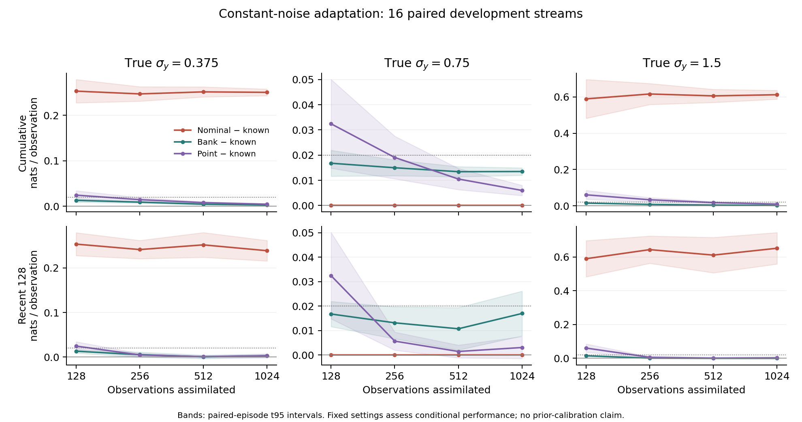

How much machinery does a tracking filter need to learn how noisy its sensor is?
In a small simulated motion problem, a classical estimator using two recent
observations and a running second moment recovered the noise scale within a
factor of 1.25 on every tested episode by observation 256. Its prediction and
update together took about **0.8 ms** in our Python CPU implementation.

A bank of nine classical filters also learned the scale. It met a prospectively
declared forecast-and-cost screen at 256 observations, but cost about **5.9 ms**
per observation. Its parameter intervals exposed a separate problem: a coarse
discrete distribution can give an accurate point estimate while badly missing
the continuous true value with its uncertainty interval.

We closed this research cycle without introducing a learned filter. That
decision combines a useful classical result with two limits: an earlier
forecast comparison could not attain its chosen statistical precision, and the
noise study did not establish a material gap beyond the classical alternatives.

*The cover shows mean excess observation log loss relative to a filter given the
true sensor scale. Bars are paired-episode 95% t intervals. Scores use observations
129–256; the dashed line is the study's chosen residual threshold. These are
development results, not an independent confirmation or a deployment guarantee.*

## A better density did not settle the forecast question

Our [previous study](/posts/bayesian-filter-repair-stopping-rule/) identified a
Gaussian-mixture compression step that lost density around a realized state.
A geometric merge rule removed the large miss, although it failed a separate
declared guardrail. We then asked whether the different filtering densities
changed forecasts enough to justify further work.

Four fixed classical filters emitted probabilities of positive velocity and
observation densities one, four, and eight steps ahead. The study reused 16
physical simulation seeds, paired across two acceleration settings. All
**95,232 forecast rows** were valid. Those many rows still represented only
16 independent physical clusters.

The primary comparison was the difference in realized eight-step Brier loss
between the original four-component filter and the geometric merge rule.
At acceleration 0.25, the mean difference was **−0.0000263**, with a paired
95% interval **[−0.0001100, 0.0000574]**; positive values would favor the
replacement. The interval included zero. Secondary probability comparisons
against a numerical reference could not substitute for that realized-score
endpoint.

The proposed investment target was especially small: ten percent of the
original filter's estimated squared probability error against the reference,
about **0.000000492** Brier units at the primary setting. None of the allowed
fresh sample sizes—64, 128, or 256 streams—could attain the declared precision.
Conservative normal-theory planning extrapolated to roughly 3.24 million
streams for the primary setting and 15.51 million for the second setting.
These estimates came from a 16-stream development panel; they are uncertain
planning calculations, not exact sample requirements or power guarantees.

We stopped that confirmation branch before opening fresh outcomes. The result
was **insufficient attainable precision for the chosen target**, not proof of
no forecast effect. The [forecast report](https://github.com/dwrtz/ml-examples/blob/f241222/docs/results/current/predictive_belief_results.md)
preserves the endpoints, planning assumptions, and numerical sensitivity.

## A separate question: what if the sensor noise is unknown?

Missing model knowledge offered a different problem. A position sensor may
have a stable noise level that the filter does not initially know. We kept the
motion model known and varied only that sensor scale.

The hidden state contains position and velocity, with an acceleration sign
that switches with probability 0.03 per observation. Acceleration magnitude
is 0.25 and velocity damping is 0.95. Observations are position plus independent
Gaussian noise whose standard deviation is 0.375, 0.75, or 1.5. Process noise,
initialization, and all other parameters stay fixed.

This was a **new development panel**: 16 new physical seeds, each generating
1024 observations at all three noise settings. Initialization, regime changes,
process noise, and standardized sensor draws were paired across settings.
We inspected the prospectively declared prefixes 128, 256, 512, and 1024.
These noise-study streams are distinct from the unopened forecast-confirmation
reservations.

Every method predicted the current observation before receiving it, then
updated its state. Latent truth was used only for offline scoring.

| Method | What it knows and retains |
|---|---|
| Known-noise control | The true noise scale; a two-component Gaussian state filter |
| Fixed nominal control | The same filter with noise scale fixed at 0.75 |
| Nine-hypothesis bank | Nine conditional state filters, one per log-spaced noise hypothesis, plus likelihood-updated parameter weights |
| Moment estimator | One state filter, two previous observations, and a running second moment used to estimate the noise scale |

The two-component state filter uses exact branching at each observation, then
moment-matches within each acceleration regime. The known-noise control is
privileged, but its state representation is still approximate.

The bank discretizes a log-uniform prior for the noise scale on [0.2, 2.0]. Each conditional filter uses its own noise value. Forecasts mix
those conditional predictions with the parameter weights available before the
new observation; that observation updates the weights only once.

For the point estimator, define the damped second difference

\[
d_t=y_t-1.95y_{t-1}+0.95y_{t-2}.
\]

The specified dynamics give
\(\mathbb{E}[d_t^2]=C+H\sigma_y^2\), where
\(C=0.076282875\) is the known motion contribution and \(H=5.705\).
We maintain the raw cumulative mean of these squares, subtract C, divide by H,
and clip the resulting variance to [0.04, 4]. The new scale is used only for
later observations. The [derivation and algorithm contract](https://github.com/dwrtz/ml-examples/blob/e0ba5c3/docs/results/current/noise_adaptation_pilot_design.md)
include the regime and process-noise contributions.

This estimate does not substitute a filter residual for sensor noise, and it
does not claim a conjugate Bayesian update. Overlapping second differences
are dependent. The point estimator supplies no parameter credible interval.

## Classical adaptation was assessable by observation 256

The main endpoint was mean one-step observation log loss over the most recent
128 observations at each prefix. The bank had to regain at least half the
off-nominal model's loss and keep its residual against the known-noise control
below **0.02 nats per observation** at every setting. Both paired t intervals
and a shared, whole-seed bootstrap had to pass. The parameter and cost targets
also had to pass, together with numerical reference checks.

Those were investigator-selected feasibility thresholds, not requirements
from a deployed application. The complete screen first passed at **256
observations**.

| True noise scale | Fixed nominal minus known, mean | Bank minus known, mean | Bank 95% t upper bound | Point minus known, mean |
|---|---:|---:|---:|---:|
| 0.375 | 0.24106 | 0.00533 | 0.01110 | 0.00475 |
| 0.750 | 0 | 0.01318 | 0.01970 | 0.00570 |
| 1.500 | 0.64321 | 0.00122 | 0.00350 | 0.00610 |

All entries are nats per observation over observations 129–256. Lower residuals
are better. The bank's bootstrap upper bounds also passed; the nominal-noise
t bound was only 0.00030 below the limit. The point estimator's t upper bounds
were all below 0.01, although it remained a separately declared practical
comparison rather than a replacement for the bank selection rule.

Both estimators were within a multiplicative factor of 1.25 of the true scale
on **16/16 seeds at each setting**. Bank median absolute log-scale errors were
0.05291, 0.11510, and 0.00014; the point estimator's were 0.04845, 0.04745,
and 0.04571.

| Method | Median episode-median prediction + update | Maximum retained algorithm state |
|---|---:|---:|
| Known-noise control | 0.83 ms | 2671 bytes |
| Fixed nominal control | 0.84 ms | 2671 bytes |
| Nine-hypothesis bank | 5.92 ms | 8959 bytes |
| Moment estimator | 0.80 ms | 3097 bytes |

These measurements use the first 256 observations on CPU in float64. Retained
state includes the model and parameter statistics. Truth scoring, file output,
and recursive memory inspection are outside the service timer; temporary arrays
and whole-process memory are recorded separately. The bank passed the declared
10 ms / 64 KiB screen. The moment estimator's storage does not grow with history.

## The learning curve prevents a stronger conclusion



*Shading shows paired t95 intervals across 16 physical seeds. Columns use
different vertical scales. The recent-window nominal-noise panel shows that
the bank's residual does not simply vanish with longer histories.*

The inexpensive point estimator had a worse start. Over the first 128
observations, its mean excess loss over the bank was 0.01152, 0.01566, and
0.04566 nats at the three settings. At nominal noise, the t interval for that
comparison included zero while the bootstrap interval did not. It would be
premature to attribute these differences specifically to representing parameter
uncertainty: the estimators, their initialization and regularization, and the
resulting state-filter histories differ too.

The bank passed the main screen again at 512, but failed the nominal-noise
residual threshold at 1024: its t and bootstrap upper bounds were 0.02612 and
0.02543 nats. Selecting 256 on this development panel does not establish a
universal learning horizon or monotonic improvement.

Parameter uncertainty was a sharper limitation. At 256 observations, the
bank's nominal 90% discrete intervals covered the continuous true scale on
only **3/16, 7/16, and 0/16** seeds. The near-1.5 grid point is actually
1.499788. Concentration on that single point gives an excellent estimate of
1.5 but an interval that misses it. Boundary mass was small; coarse-grid
concentration is the relevant limitation here.

The three fixed noise settings are conditional checks, not draws from the
bank's prior. Neither these coverage counts nor good observation forecasts
establish continuous-parameter or prior-predictive calibration.

## Numerical agreement had a limited scope too

On the first two physical seeds, we refined the parameter grid from 17 to 33
hypotheses while holding state capacity at two components, then compared
eight versus 32 state components at the 33-hypothesis grid.
At prefix 256, every required maximum episode-mean log-loss shift was below
**0.00145 nats**, within the declared 0.005 numerical margin. The short
eight-observation exact-enumeration checks also passed.

At 1024, parameter-grid refinement changes reached 0.00559 and 0.00518 at the
low and high noise settings, so numerical acceptance did not extend to that
prefix. Agreement at 256 is empirical sensitivity on two physical clusters,
not certification of an exact continuous-parameter posterior.

Against the strongest reference at 256, the point estimator's mean residuals
were 0.00250, 0.00389, and 0.00615 nats. Every paired t interval crossed zero.
The low- and high-noise intervals also extended above 0.02. A material gap was
not established, but the small reference subset could not exclude every such
gap either.

## Closing the cycle

The forecast-compression study stopped because its chosen precision target
was unattainable within the declared sample menu. The separate noise study
showed that missing sensor knowledge creates a measurable problem and that
small classical estimators can address it at the selected development horizon.

That is enough to retain the moment estimator as an inexpensive baseline and
close this cycle. It is not proof that classical methods are optimal, that
parameter uncertainty is calibrated, or that a learned method could never help.
We did not launch the optional scalar attribution appendix, a new startup
uncertainty experiment, or online neural adaptation.

A future study would need its own useful predictive or uncertainty target,
adequate reference precision, and a demonstrated gap beyond affordable
classical methods. Implementing adaptation alone would not supply that research
justification.

## Code, data, and reproducibility

The [noise-study protocol and implementation](https://github.com/dwrtz/ml-examples/commit/e0ba5c35b1d1e664d25c6e4def9aef6e6c13e2d9)
were committed before opening its development outcomes. The completed run
contains **196,608 main predictions and 24,576 reference predictions**, all
valid, with no missing rows. The maximum discrepancy between the emitted
log density and update evidence was 1.78e-15.

The full pilot took about **20.3 CPU minutes**, including numerical references
and analysis, within a two CPU-hour ceiling. The final focused suite passed
**103 tests** and repository lint passed. The repository-wide run reported
846 passes, 10 failures, and four setup errors; the failures came from the
previously missing historical checkpoint and source-metric inputs. They were
not fabricated or silently skipped.

- [Complete noise-study report](https://github.com/dwrtz/ml-examples/blob/f817d25/docs/results/current/online_model_adaptation_opportunity.md), including calibration tables and resource accounting.
- [Authenticated inputs, predictions, scores, and numerical checks](https://github.com/dwrtz/ml-examples/tree/f817d25/docs/results/current/noise_adaptation_opportunity_v1), with all 16 physical seed IDs in the allocation manifest.
- [Frozen noise-study configuration](https://github.com/dwrtz/ml-examples/blob/e0ba5c3/experiments/noise_adaptation/01_opportunity.yaml) and [runner](https://github.com/dwrtz/ml-examples/blob/e0ba5c3/scripts/evaluate_noise_adaptation.py).
- [Forecast-compression report and stopping calculation](https://github.com/dwrtz/ml-examples/blob/f241222/docs/results/current/predictive_belief_results.md).
- [Cover data](artifacts/forecast-residuals.csv) and [development decision](artifacts/development-decision.json).

To recompute the noise-study tables from saved predictions, follow the
artifact-only command in the full report. A full simulation replay uses

```bash
OPENBLAS_NUM_THREADS=1 OMP_NUM_THREADS=1 MKL_NUM_THREADS=1 \
  uv run python scripts/evaluate_noise_adaptation.py
```

Use a separate checkout of the frozen implementation with its declared output
directory absent. The driver refuses to overwrite existing evidence or reuse
already declared seeds. The numerical environment was Python 3.12.9,
NumPy 2.4.4, SciPy 1.17.1, float64 on macOS arm64 CPU.
